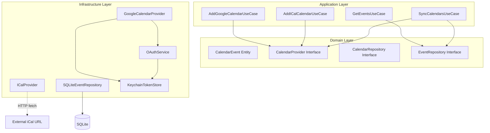

# Design Document - calendar-integration

## Overview

カレンダー統合機能の技術設計。Google Calendar API（OAuth 2.0）とiCal URL取り込みを実装し、複数カレンダーからのイベント取得・キャッシュ・同期を提供する。DDD + 関数型プログラミングのアーキテクチャに従い、ドメイン層とインフラ層を分離する。

## Steering Document Alignment

### Technical Standards (CLAUDE.md)

- **Mastraのレールに乗る**: カレンダーToolはMastra Toolsとして実装（将来のAI連携用）
- **セキュリティ**: OAuth トークンは keytar で macOS Keychain に保存
- **DDD + 関数型**: Result型、イミュータブル、レイヤー分離

### Project Structure (CLAUDE.md)

```
lib/
├── domain/calendar/          # カレンダードメイン層
├── application/calendar/     # ユースケース層
├── infrastructure/calendar/  # Google/iCal実装
└── mastra/tools/calendar.ts  # Mastra Tool定義
```

## Code Reuse Analysis

### Existing Components to Leverage

- **`lib/domain/shared/result.ts`**: Result<T, E>型でエラーハンドリング
- **`lib/domain/shared/option.ts`**: Option<T>型で値の有無を表現
- **`lib/domain/shared/types.ts`**: Brand型パターン（CalendarId等）
- **`lib/infrastructure/keychain/`**: OAuth トークンの安全な保存
- **`lib/infrastructure/db/`**: SQLiteキャッシュ用の接続管理
- **`lib/config/`**: カレンダー設定の永続化

### Integration Points

- **Keychain**: `setSecret`, `getSecret` でOAuthトークン管理
- **SQLite**: イベントキャッシュテーブル
- **config.json**: `calendars[]` 配列でカレンダー設定保存

## Architecture



### Modular Design Principles

- **Single File Responsibility**: プロバイダ（Google, iCal）は個別ファイル
- **Component Isolation**: OAuth、イベント取得、キャッシュは独立サービス
- **Service Layer Separation**: ドメイン層はインフラに依存しない
- **Utility Modularity**: 日付計算、iCalパースは独立ユーティリティ

## Components and Interfaces

### Domain Layer

#### CalendarEvent Entity

- **Purpose**: カレンダーイベントを表現するエンティティ
- **Location**: `lib/domain/calendar/event.ts`

```typescript
interface CalendarEvent {
  readonly id: EventId;
  readonly calendarId: CalendarId;
  readonly title: string;
  readonly startTime: Date;
  readonly endTime: Date;
  readonly isAllDay: boolean;
  readonly location: Option<string>;
  readonly description: Option<string>;
  readonly source: CalendarSource;
}

type CalendarSource = {
  readonly type: 'google' | 'ical';
  readonly calendarName: string;
  readonly accountEmail?: string;  // Google用
};
```

#### CalendarProvider Interface

- **Purpose**: カレンダープロバイダの抽象インターフェース
- **Location**: `lib/domain/calendar/provider.ts`

```typescript
interface CalendarProvider {
  readonly type: 'google' | 'ical';

  getCalendars(): Promise<Result<Calendar[], CalendarError>>;
  getEvents(
    calendarId: CalendarId,
    range: TimeRange
  ): Promise<Result<CalendarEvent[], CalendarError>>;
}
```

#### Repository Interfaces

- **Location**: `lib/domain/calendar/repository.ts`

```typescript
interface CalendarRepository {
  findAll(): Promise<Result<CalendarConfig[], ConfigError>>;
  save(calendar: CalendarConfig): Promise<Result<void, ConfigError>>;
  delete(id: CalendarId): Promise<Result<void, ConfigError>>;
}

interface EventRepository {
  findByRange(range: TimeRange): Promise<Result<CalendarEvent[], DbError>>;
  saveMany(events: CalendarEvent[]): Promise<Result<void, DbError>>;
  deleteByCalendar(calendarId: CalendarId): Promise<Result<void, DbError>>;
  getLastSyncTime(calendarId: CalendarId): Promise<Result<Option<Date>, DbError>>;
  updateLastSyncTime(calendarId: CalendarId, time: Date): Promise<Result<void, DbError>>;
}
```

### Infrastructure Layer

#### GoogleCalendarProvider

- **Purpose**: Google Calendar APIとの通信
- **Location**: `lib/infrastructure/calendar/google-provider.ts`
- **Dependencies**: googleapis, keychain
- **Reuses**: `lib/infrastructure/keychain/` (トークン管理)

```typescript
class GoogleCalendarProvider implements CalendarProvider {
  constructor(
    private readonly tokenStore: TokenStore,
    private readonly accountEmail: string
  ) {}

  // OAuth認証フロー開始
  static startAuth(redirectUri: string): AuthUrl;

  // 認証コード交換
  static exchangeCode(code: string): Promise<Result<Tokens, AuthError>>;

  // トークンリフレッシュ
  private refreshTokenIfNeeded(): Promise<Result<void, AuthError>>;
}
```

#### ICalProvider

- **Purpose**: iCal URLからのイベント取得
- **Location**: `lib/infrastructure/calendar/ical-provider.ts`
- **Dependencies**: ical.js (パーサー)

```typescript
class ICalProvider implements CalendarProvider {
  constructor(
    private readonly url: string,
    private readonly name: string
  ) {}

  // URL有効性検証
  static validateUrl(url: string): Promise<Result<ICalMeta, ICalError>>;
}
```

#### OAuthService

- **Purpose**: Google OAuth 2.0 PKCE フロー管理
- **Location**: `lib/infrastructure/calendar/oauth-service.ts`

```typescript
interface OAuthService {
  // 認証URL生成（PKCE code_verifier含む）
  generateAuthUrl(): { url: string; codeVerifier: string };

  // コード交換
  exchangeCode(
    code: string,
    codeVerifier: string
  ): Promise<Result<OAuthTokens, AuthError>>;

  // トークンリフレッシュ
  refreshToken(
    refreshToken: string
  ): Promise<Result<OAuthTokens, AuthError>>;
}

interface OAuthTokens {
  readonly accessToken: string;
  readonly refreshToken: string;
  readonly expiresAt: Date;
}
```

#### SQLiteEventRepository

- **Purpose**: イベントキャッシュの永続化
- **Location**: `lib/infrastructure/db/event-repository.ts`
- **Reuses**: `lib/infrastructure/db/connection.ts`

### Application Layer (Use Cases)

#### AddGoogleCalendarUseCase

- **Location**: `lib/application/calendar/add-google-calendar.ts`
- **Flow**:
  1. OAuth認証URL生成
  2. コールバック待機
  3. トークン交換・保存
  4. カレンダー一覧取得
  5. 設定に追加

#### GetEventsUseCase

- **Location**: `lib/application/calendar/get-events.ts`
- **Flow**:
  1. キャッシュ確認
  2. 古い場合はAPI取得
  3. 複数カレンダー統合・ソート

#### SyncCalendarsUseCase

- **Location**: `lib/application/calendar/sync-calendars.ts`
- **Flow**:
  1. 全有効カレンダー取得
  2. 並列でイベント取得
  3. キャッシュ更新
  4. 同期時刻更新

## Data Models

### SQLite Schema

```sql
-- カレンダーイベントキャッシュ
CREATE TABLE calendar_events (
  id TEXT PRIMARY KEY,           -- eventId + calendarId のハッシュ
  event_id TEXT NOT NULL,
  calendar_id TEXT NOT NULL,
  title TEXT NOT NULL,
  start_time TEXT NOT NULL,      -- ISO8601
  end_time TEXT NOT NULL,        -- ISO8601
  is_all_day INTEGER NOT NULL,   -- 0 or 1
  location TEXT,
  description TEXT,
  source_type TEXT NOT NULL,     -- 'google' | 'ical'
  source_name TEXT NOT NULL,
  source_account TEXT,           -- Google用メールアドレス
  cached_at TEXT NOT NULL,       -- ISO8601
  UNIQUE(event_id, calendar_id)
);

-- 同期状態
CREATE TABLE calendar_sync_state (
  calendar_id TEXT PRIMARY KEY,
  last_sync_time TEXT NOT NULL,  -- ISO8601
  sync_status TEXT NOT NULL      -- 'success' | 'error'
);

-- インデックス
CREATE INDEX idx_events_range ON calendar_events(start_time, end_time);
CREATE INDEX idx_events_calendar ON calendar_events(calendar_id);
```

### Config Schema (config.json拡張)

```typescript
interface AppConfig {
  // ... existing fields
  calendars: CalendarConfig[];
}

interface CalendarConfig {
  readonly id: CalendarId;
  readonly type: 'google' | 'ical';
  readonly name: string;
  readonly enabled: boolean;
  readonly color?: string;

  // Google固有
  readonly googleAccountEmail?: string;
  readonly googleCalendarId?: string;

  // iCal固有
  readonly icalUrl?: string;
}
```

### Keychain Keys

```typescript
// Google OAuthトークン（アカウント別）
type GoogleTokenKey = `google-oauth-${accountEmail}`;

// 保存形式
interface StoredTokens {
  accessToken: string;
  refreshToken: string;
  expiresAt: string;  // ISO8601
}
```

## API Routes

### OAuth Callback

```typescript
// GET /api/auth/google/callback?code=xxx&state=xxx
// OAuth認証コールバック処理
```

### Calendar API

```typescript
// GET /api/calendars
// カレンダー一覧取得

// POST /api/calendars/google
// Googleカレンダー追加開始（認証URL返却）

// POST /api/calendars/ical
// iCalカレンダー追加

// DELETE /api/calendars/:id
// カレンダー削除

// POST /api/calendars/sync
// 全カレンダー同期

// GET /api/events?range=today|week
// イベント取得
```

## Error Handling

### Error Types

```typescript
type CalendarError =
  | { code: 'AUTH_REQUIRED'; message: string }
  | { code: 'AUTH_EXPIRED'; message: string; accountEmail: string }
  | { code: 'API_ERROR'; message: string; statusCode: number }
  | { code: 'NETWORK_ERROR'; message: string }
  | { code: 'PARSE_ERROR'; message: string }
  | { code: 'NOT_FOUND'; message: string };
```

### Error Scenarios

1. **OAuth トークン期限切れ**
   - Handling: 自動リフレッシュ、失敗時は再認証要求
   - User Impact: 通常は透過的、失敗時は「再認証が必要です」

2. **iCal URL アクセス不可**
   - Handling: キャッシュにフォールバック
   - User Impact: 「最終更新: XX分前（同期エラー）」

3. **ネットワークエラー**
   - Handling: キャッシュから返却
   - User Impact: 「オフラインモード」表示

4. **Google API レート制限**
   - Handling: 指数バックオフでリトライ
   - User Impact: 同期が遅延する旨を表示

## Dependencies

### npm packages

```json
{
  "googleapis": "^144.0.0",
  "ical.js": "^2.1.0"
}
```

- **googleapis**: Google Calendar API 公式クライアント
- **ical.js**: iCalendar (RFC 5545) パーサー

## Testing Strategy

### Unit Testing

- CalendarEvent値オブジェクトの生成・バリデーション
- TimeRange計算（今日、今週の範囲）
- iCalパース処理
- Result型のエラーハンドリング

### Integration Testing

- SQLite EventRepository のCRUD
- Keychain TokenStore のトークン保存・取得
- OAuth トークンリフレッシュフロー

### E2E Testing（手動）

- Google OAuth認証フロー
- 複数カレンダー追加・同期
- オフライン時のキャッシュ動作

## References

- [Google Calendar API Quickstart (Node.js)](https://developers.google.com/workspace/calendar/api/quickstart/nodejs)
- [Google OAuth 2.0 Documentation](https://developers.google.com/identity/protocols/oauth2)
- [googleapis/google-api-nodejs-client](https://github.com/googleapis/google-api-nodejs-client)
