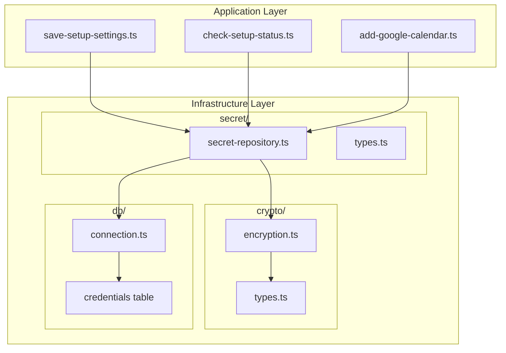

# Design Document: credential-storage

## Overview

keytarからDB暗号化への移行設計。既存のResult型・Option型パターンを踏襲し、keytar-adapter.tsと同一インターフェースの暗号化リポジトリを実装する。Node.js標準cryptoモジュールでAES-256-GCM暗号化を行い、SQLiteに保存する。

## Steering Document Alignment

### Technical Standards (tech.md)
- **関数型プログラミング**: Result型、Option型を維持
- **DDD**: インフラ層（crypto, db）とドメイン層を分離
- **型安全性**: discriminated union、型ガードを活用

### Project Structure (structure.md)
- `lib/infrastructure/crypto/` - 新規暗号化モジュール
- `lib/infrastructure/db/` - 既存DB層にテーブル追加
- `lib/infrastructure/keychain/` → `lib/infrastructure/secret/` にリネーム

## Code Reuse Analysis

### Existing Components to Leverage
- **Result型 (lib/domain/shared/result.ts)**: ok/err、map/flatMap/match
- **Option型 (lib/domain/shared/option.ts)**: some/none、isSome/isNone
- **DB接続 (lib/infrastructure/db/connection.ts)**: getDatabase()、マイグレーション機構
- **エラーファクトリ (lib/domain/shared/errors.ts)**: AppError基底クラス

### Integration Points
- **keytar-adapter.ts**: インターフェースを完全互換で置き換え
- **token-store.ts**: 暗号化リポジトリ経由に変更
- **アプリケーション層**: 変更なし（インターフェース維持）

## Architecture



## Components and Interfaces

### Component 1: 暗号化モジュール (lib/infrastructure/crypto/)

**Purpose:** AES-256-GCM暗号化・復号化を提供

**ファイル構成:**
```
lib/infrastructure/crypto/
├── encryption.ts    # 暗号化・復号化関数
├── types.ts         # 型定義・エラー型
└── index.ts         # 公開API
```

**Interfaces:**
```typescript
// encryption.ts
export function encrypt(
  plaintext: string,
  key: Buffer
): Result<EncryptedData, CryptoError>

export function decrypt(
  encrypted: EncryptedData,
  key: Buffer
): Result<string, CryptoError>

export function getEncryptionKey(): Result<Buffer, CryptoError>
```

**Dependencies:** Node.js crypto (標準モジュール)

### Component 2: シークレットリポジトリ (lib/infrastructure/secret/)

**Purpose:** 暗号化されたシークレットのCRUD操作

**ファイル構成:**
```
lib/infrastructure/secret/
├── secret-repository.ts  # リポジトリ実装
├── types.ts              # SecretKey型、エラー型
└── index.ts              # 公開API
```

**Interfaces (keytar-adapter互換):**
```typescript
// secret-repository.ts
export async function getSecret(
  key: SecretKey
): Promise<Result<Option<string>, SecretError>>

export async function setSecret(
  key: SecretKey,
  value: string
): Promise<Result<void, SecretError>>

export async function deleteSecret(
  key: SecretKey
): Promise<Result<void, SecretError>>

export async function hasSecret(
  key: SecretKey
): Promise<Result<boolean, SecretError>>

export async function getSecrets(
  keys: readonly SecretKey[]
): Promise<Result<Map<SecretKey, Option<string>>, SecretError>>
```

**Dependencies:** crypto/, db/

### Component 3: token-store更新 (lib/infrastructure/calendar/)

**Purpose:** Google OAuthトークンを暗号化リポジトリ経由で保存

**変更点:**
- keytarの直接使用を削除
- secret-repository経由に変更
- インターフェースは維持

```typescript
// 変更前
import keytar from "keytar";
await keytar.setPassword(SERVICE, key, JSON.stringify(tokens));

// 変更後
import { setSecret } from "../secret";
await setSecret(key, JSON.stringify(tokens));
```

## Data Models

### credentials テーブル (新規)

```sql
CREATE TABLE credentials (
  key TEXT PRIMARY KEY,
  encrypted_value TEXT NOT NULL,
  created_at TEXT NOT NULL,
  updated_at TEXT NOT NULL
);
```

**フィールド説明:**
- `key`: SecretKey ("anthropic-api-key", "google-oauth-user@example.com" 等)
- `encrypted_value`: Base64エンコードされた暗号化データ (IV + AuthTag + Ciphertext)
- `created_at`: ISO 8601形式
- `updated_at`: ISO 8601形式

### EncryptedData 型

```typescript
interface EncryptedData {
  readonly iv: Buffer;        // 12 bytes
  readonly authTag: Buffer;   // 16 bytes
  readonly ciphertext: Buffer;
}

// シリアライズ形式 (Base64)
// [IV 12bytes][AuthTag 16bytes][Ciphertext N bytes]
```

### SecretKey 型 (既存互換)

```typescript
type LLMSecretKey =
  | "anthropic-api-key"
  | "openai-api-key"
  | "ollama-api-key"
  | "gemini-api-key";

// 動的キー対応（Googleアカウントごと）
type DynamicSecretKey = `google-oauth-${string}`;

type SecretKey = LLMSecretKey | DynamicSecretKey;
```

## Error Handling

### Error Types

```typescript
// crypto/types.ts
type CryptoErrorCode =
  | "ENCRYPTION_KEY_MISSING"    // 環境変数未設定
  | "ENCRYPTION_KEY_INVALID"    // キー長不正
  | "ENCRYPTION_FAILED"         // 暗号化失敗
  | "DECRYPTION_FAILED";        // 復号化失敗（改ざん検知含む）

interface CryptoError extends AppError {
  readonly code: CryptoErrorCode;
}

// secret/types.ts
type SecretErrorCode =
  | "SECRET_NOT_FOUND"
  | "SECRET_WRITE_FAILED"
  | "SECRET_DELETE_FAILED"
  | CryptoErrorCode;  // 暗号化エラーを含む

interface SecretError extends AppError {
  readonly code: SecretErrorCode;
}
```

### Error Scenarios

1. **ENCRYPTION_KEY_MISSING**
   - **Handling:** アプリ起動時にチェック、明確なメッセージ表示
   - **User Impact:** セットアップ画面でキー設定方法を案内

2. **DECRYPTION_FAILED**
   - **Handling:** データ破損として扱い、該当レコードを削除可能に
   - **User Impact:** 再認証を促すメッセージ表示

3. **SECRET_WRITE_FAILED**
   - **Handling:** DBエラーをラップしてResult型で返却
   - **User Impact:** 保存失敗のエラーメッセージ表示

## Implementation Details

### 暗号化フロー

```typescript
function encrypt(plaintext: string, key: Buffer): Result<EncryptedData, CryptoError> {
  // 1. ランダムIV生成 (12 bytes for GCM)
  const iv = crypto.randomBytes(12);

  // 2. Cipher作成
  const cipher = crypto.createCipheriv("aes-256-gcm", key, iv);

  // 3. 暗号化
  const ciphertext = Buffer.concat([
    cipher.update(plaintext, "utf8"),
    cipher.final()
  ]);

  // 4. AuthTag取得
  const authTag = cipher.getAuthTag();

  return ok({ iv, authTag, ciphertext });
}
```

### 復号化フロー

```typescript
function decrypt(encrypted: EncryptedData, key: Buffer): Result<string, CryptoError> {
  try {
    const decipher = crypto.createDecipheriv("aes-256-gcm", key, encrypted.iv);
    decipher.setAuthTag(encrypted.authTag);

    const plaintext = Buffer.concat([
      decipher.update(encrypted.ciphertext),
      decipher.final()
    ]);

    return ok(plaintext.toString("utf8"));
  } catch (error) {
    // AuthTag検証失敗 = 改ざんまたは不正データ
    return err(decryptionFailed("Decryption failed", error));
  }
}
```

### 環境変数からのキー取得

```typescript
function getEncryptionKey(): Result<Buffer, CryptoError> {
  const keyBase64 = process.env.MIIPA_ENCRYPTION_KEY;

  if (!keyBase64) {
    return err(encryptionKeyMissing(
      "MIIPA_ENCRYPTION_KEY is not set. " +
      "Generate with: openssl rand -base64 32"
    ));
  }

  const key = Buffer.from(keyBase64, "base64");

  if (key.length !== 32) {
    return err(encryptionKeyInvalid(
      `Key must be 32 bytes, got ${key.length}`
    ));
  }

  return ok(key);
}
```

### DB保存形式

```typescript
// シリアライズ (EncryptedData → string)
function serialize(data: EncryptedData): string {
  const combined = Buffer.concat([data.iv, data.authTag, data.ciphertext]);
  return combined.toString("base64");
}

// デシリアライズ (string → EncryptedData)
function deserialize(base64: string): EncryptedData {
  const combined = Buffer.from(base64, "base64");
  return {
    iv: combined.subarray(0, 12),
    authTag: combined.subarray(12, 28),
    ciphertext: combined.subarray(28)
  };
}
```

## Migration Strategy

### Phase 1: 新モジュール追加
1. `lib/infrastructure/crypto/` 作成
2. `lib/infrastructure/secret/` 作成
3. DBマイグレーション（credentialsテーブル）追加

### Phase 2: 依存関係切り替え
1. token-store.tsをsecret-repository経由に変更
2. アプリケーション層のimportパスを変更

### Phase 3: keytar削除
1. keytar-adapter.ts削除
2. package.jsonからkeytar削除
3. 動作確認

### 既存データ移行
**スコープ外**: 新規インストール前提。既存ユーザーは再セットアップが必要。

## Testing Strategy

### Unit Testing
- 暗号化/復号化の往復テスト
- 不正データでの復号化失敗テスト
- 環境変数未設定時のエラーテスト
- SecretKeyの各種パターンテスト

### Integration Testing
- DB保存→取得の往復テスト
- 複数シークレットの保存・取得テスト
- token-store経由のOAuthトークン保存テスト

### End-to-End Testing
- セットアップフロー（LLM APIキー保存）
- Google Calendar認証フロー（OAuthトークン保存）
- アプリ再起動後のトークン読み込み

## File Changes Summary

### 新規作成
- `lib/infrastructure/crypto/encryption.ts`
- `lib/infrastructure/crypto/types.ts`
- `lib/infrastructure/crypto/index.ts`
- `lib/infrastructure/secret/secret-repository.ts`
- `lib/infrastructure/secret/types.ts`
- `lib/infrastructure/secret/index.ts`
- `lib/infrastructure/db/migrations/003_credentials.sql`

### 変更
- `lib/infrastructure/calendar/token-store.ts` - secret-repository使用に変更
- `lib/application/setup/save-setup-settings.ts` - importパス変更
- `lib/application/setup/check-setup-status.ts` - importパス変更
- `lib/domain/shared/errors.ts` - CryptoError, SecretError追加

### 削除
- `lib/infrastructure/keychain/keytar-adapter.ts`
- `lib/infrastructure/keychain/types.ts`
- `lib/infrastructure/keychain/index.ts`
- `package.json`からkeytar依存削除
