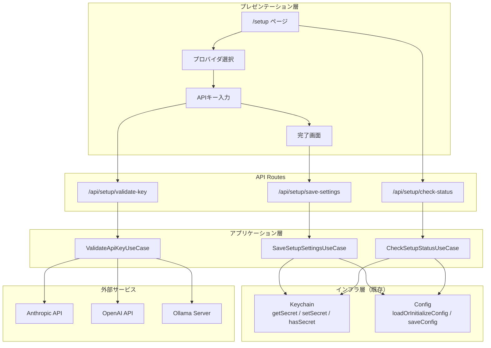
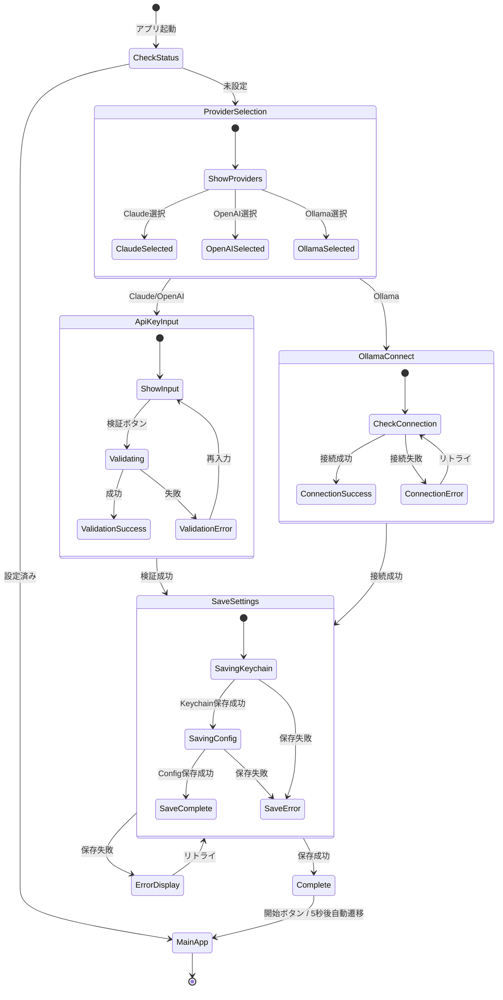
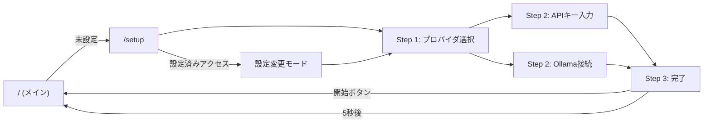

# Design Document - Onboarding

## Overview

本文書は、miipaの初回起動時セットアップ（オンボーディング）機能の設計を定義する。ユーザーがアプリケーションを初めて起動した際に、LLMプロバイダの選択からAPIキーの設定までを3ステップ以内で完了できる、シンプルで直感的なセットアップフローを提供する。

「30秒で設定完了」を目標とし、一人社長が迷わずに使い始められるUXを最優先とする。

## Steering Document Alignment

### Technical Standards (tech.md)

本設計は以下の技術標準に従う:

- **TypeScript**: strict モード有効、型安全性を最優先
- **関数型プログラミング**: Result/Option型による明示的なエラーハンドリング
- **DDD**: ドメイン層をインフラ層から分離
- **コーディング規約**: Biome による一貫したスタイル強制
- **UIライブラリ**: Park UI + Panda CSS によるアクセシブルなUI

### Project Structure (structure.md)

CLAUDE.md で定義されたディレクトリ構成に準拠:

```
miipa/
├── app/
│   ├── setup/
│   │   └── page.tsx              # セットアップ画面
│   └── api/
│       └── setup/
│           ├── validate-key/     # APIキー検証エンドポイント
│           └── save-settings/    # 設定保存エンドポイント
├── components/
│   └── setup/                    # セットアップ関連コンポーネント
├── lib/
│   ├── application/
│   │   └── setup/               # セットアップユースケース
│   └── infrastructure/
│       └── keychain/            # Keychain統合（既存）
```

## Code Reuse Analysis

### Existing Components to Leverage

project-setupで実装済みの基盤を最大限活用する:

| コンポーネント | 場所 | 活用方法 |
|--------------|------|---------|
| **Result型** | `lib/domain/shared/result.ts` | 全操作のエラーハンドリング |
| **Option型** | `lib/domain/shared/option.ts` | APIキーの存在確認 |
| **エラー型** | `lib/domain/shared/errors.ts` | KeychainError, ConfigError |
| **Keychain統合** | `lib/infrastructure/keychain/` | APIキーの保存・取得・存在確認 |
| **設定管理** | `lib/config/` | 設定ファイルの読み書き |

### Integration Points

- **Keychain**: `setSecret`, `getSecret`, `hasSecret` でAPIキー管理
- **設定ファイル**: `loadOrInitializeConfig`, `saveConfig` で設定永続化
- **SecretKey型**: `anthropic-api-key`, `openai-api-key`, `ollama-api-key`
- **LLMConfig型**: `provider`, `model`, `apiKeyRef`, `baseUrl`

## Architecture

### アーキテクチャ概要

セットアップフローは、React Server Components + API Routes + 既存インフラ層の組み合わせで実装する。



### セットアップフロー



### Modular Design Principles

- **Single File Responsibility**: 各コンポーネントは単一の明確な目的を持つ
  - `ProviderCard.tsx`: プロバイダ選択カード
  - `ApiKeyForm.tsx`: APIキー入力フォーム
  - `SetupStepper.tsx`: ステップインジケータ
- **Component Isolation**: 小さく焦点を絞ったコンポーネント
  - 各ステップは独立したコンポーネント
  - 状態管理はページレベルで統一
- **Service Layer Separation**:
  - UIコンポーネント → API Routes → アプリケーション層 → インフラ層

## Components and Interfaces

### Component 1: SetupPage (`app/setup/page.tsx`)

**Purpose:** セットアップフローの統括ページ

**Interfaces:**

```typescript
// ページコンポーネント（Server Component）
export default async function SetupPage(): Promise<JSX.Element>;

// クライアント側状態管理
interface SetupState {
  currentStep: 'provider' | 'key' | 'complete';
  selectedProvider: LLMProvider | null;
  isValidated: boolean;
  isExistingSetup: boolean;  // 設定変更モードかどうか
}
```

**Dependencies:**
- `@/lib/config/loader` - `loadOrInitializeConfig`
- `@/lib/infrastructure/keychain` - `hasSecret`
- 子コンポーネント群

**Reuses:**
- `lib/config/types.ts` - `LLMProvider`, `AppConfig`
- `lib/infrastructure/keychain/types.ts` - `SecretKey`

### Component 2: ProviderSelector (`components/setup/ProviderSelector.tsx`)

**Purpose:** LLMプロバイダ選択UI

**Interfaces:**

```typescript
interface ProviderSelectorProps {
  selectedProvider: LLMProvider | null;
  currentProvider?: LLMProvider;  // 既存設定（変更モード時）
  onSelect: (provider: LLMProvider) => void;
  disabled?: boolean;
}

interface ProviderOption {
  id: LLMProvider;
  name: string;
  description: string;
  icon: React.ReactNode;
  isRecommended: boolean;
  requiresApiKey: boolean;
}
```

**Dependencies:**
- Park UI: `Card`, `Text`, `Badge`
- Panda CSS: スタイリング

**Reuses:**
- `lib/config/types.ts` - `LLMProvider`

### Component 3: ApiKeyForm (`components/setup/ApiKeyForm.tsx`)

**Purpose:** APIキー入力・検証UI

**Interfaces:**

```typescript
interface ApiKeyFormProps {
  provider: LLMProvider;
  onValidated: (isValid: boolean) => void;
  onKeyChange: (key: string) => void;
}

interface ValidationState {
  status: 'idle' | 'validating' | 'success' | 'error';
  errorMessage?: string;
}

// APIキー検証関数の型
type ValidateApiKey = (
  provider: LLMProvider,
  apiKey: string
) => Promise<Result<void, ApiKeyValidationError>>;
```

**Dependencies:**
- Park UI: `Input`, `Button`, `Alert`, `Spinner`
- `@/lib/domain/shared` - Result型

**Reuses:**
- `lib/config/types.ts` - `LLMProvider`
- `lib/domain/shared/result.ts` - `Result`, `isOk`, `isErr`

### Component 4: OllamaConnector (`components/setup/OllamaConnector.tsx`)

**Purpose:** Ollama接続確認UI

**Interfaces:**

```typescript
interface OllamaConnectorProps {
  onConnected: () => void;
  defaultUrl?: string;
}

interface OllamaConnectionState {
  url: string;
  status: 'idle' | 'connecting' | 'connected' | 'error';
  errorMessage?: string;
  availableModels?: string[];
}
```

**Dependencies:**
- Park UI: `Input`, `Button`, `Alert`, `Select`

### Component 5: SetupStepper (`components/setup/SetupStepper.tsx`)

**Purpose:** セットアップ進捗インジケータ

**Interfaces:**

```typescript
interface SetupStepperProps {
  currentStep: number;
  totalSteps: number;
  steps: StepInfo[];
}

interface StepInfo {
  label: string;
  description?: string;
}
```

**Dependencies:**
- Park UI: `Steps` コンポーネント
- Panda CSS: カスタムスタイリング

### Component 6: SetupComplete (`components/setup/SetupComplete.tsx`)

**Purpose:** セットアップ完了画面

**Interfaces:**

```typescript
interface SetupCompleteProps {
  provider: LLMProvider;
  onStart: () => void;
  autoRedirectSeconds?: number;  // デフォルト: 5
}
```

**Dependencies:**
- Park UI: `Card`, `Button`, `Text`
- ミーアキャットイラスト（SVG）

### Component 7: ValidateApiKeyUseCase (`lib/application/setup/validate-api-key.ts`)

**Purpose:** APIキーの検証ロジック

**Interfaces:**

```typescript
// エラー型
interface ApiKeyValidationError {
  code: 'INVALID_FORMAT' | 'API_ERROR' | 'TIMEOUT' | 'NETWORK_ERROR';
  message: string;
  cause?: unknown;
}

// 検証関数
async function validateApiKey(
  provider: LLMProvider,
  apiKey: string
): Promise<Result<void, ApiKeyValidationError>>;

// プロバイダ別検証
async function validateClaudeKey(apiKey: string): Promise<Result<void, ApiKeyValidationError>>;
async function validateOpenAIKey(apiKey: string): Promise<Result<void, ApiKeyValidationError>>;
async function validateOllamaConnection(baseUrl: string): Promise<Result<string[], ApiKeyValidationError>>;
```

**Dependencies:**
- `lib/domain/shared/result.ts`
- Anthropic SDK / OpenAI SDK（オプション）

**Reuses:**
- `lib/domain/shared/result.ts` - `ok`, `err`, `Result`
- `lib/config/types.ts` - `LLMProvider`

### Component 8: SaveSetupSettingsUseCase (`lib/application/setup/save-setup-settings.ts`)

**Purpose:** セットアップ設定の保存ロジック

**Interfaces:**

```typescript
interface SetupSettings {
  provider: LLMProvider;
  apiKey?: string;        // Claude/OpenAI用
  baseUrl?: string;       // Ollama用
  model?: string;         // オプション
}

// 保存関数
async function saveSetupSettings(
  settings: SetupSettings
): Promise<Result<void, ConfigError | KeychainError>>;

// 既存設定の上書き確認が必要な場合
interface SaveOptions {
  overwriteExisting?: boolean;
}
```

**Dependencies:**
- `lib/infrastructure/keychain` - `setSecret`, `hasSecret`
- `lib/config/loader` - `loadOrInitializeConfig`, `saveConfig`
- `lib/domain/shared/result.ts`

**Reuses:**
- `lib/infrastructure/keychain/index.ts` - 全関数
- `lib/config/loader.ts` - `loadOrInitializeConfig`, `saveConfig`
- `lib/config/types.ts` - `AppConfig`, `LLMConfig`
- `lib/domain/shared/errors.ts` - `ConfigError`, `KeychainError`

### Component 9: CheckSetupStatusUseCase (`lib/application/setup/check-setup-status.ts`)

**Purpose:** セットアップ状態の確認ロジック

**Interfaces:**

```typescript
interface SetupStatus {
  isComplete: boolean;
  currentProvider?: LLMProvider;
  hasApiKey: boolean;
}

// 確認関数
async function checkSetupStatus(): Promise<Result<SetupStatus, ConfigError | KeychainError>>;

// 初回起動検出
async function isFirstLaunch(): Promise<Result<boolean, ConfigError>>;
```

**Dependencies:**
- `lib/infrastructure/keychain` - `hasSecret`
- `lib/config/loader` - `configExists`, `loadConfig`

**Reuses:**
- `lib/infrastructure/keychain/index.ts` - `hasSecret`
- `lib/config/loader.ts` - `configExists`, `loadConfig`
- `lib/config/types.ts` - `LLMProvider`

## Data Models

### Model 1: SetupSettings（セットアップ設定）

```typescript
// lib/application/setup/types.ts

/**
 * セットアップ時に入力される設定
 */
interface SetupSettings {
  /** 選択されたLLMプロバイダ */
  readonly provider: LLMProvider;

  /** APIキー（Claude/OpenAI用） */
  readonly apiKey?: string;

  /** OllamaのベースURL */
  readonly baseUrl?: string;

  /** 使用するモデル（省略時はプロバイダデフォルト） */
  readonly model?: string;
}

/**
 * セットアップの状態
 */
interface SetupStatus {
  /** セットアップが完了しているか */
  readonly isComplete: boolean;

  /** 現在設定されているプロバイダ */
  readonly currentProvider?: LLMProvider;

  /** APIキーが設定されているか */
  readonly hasApiKey: boolean;
}
```

### Model 2: APIキー検証結果

```typescript
// lib/application/setup/types.ts

/**
 * APIキー検証エラーコード
 */
type ApiKeyValidationErrorCode =
  | 'INVALID_FORMAT'    // APIキーの形式が不正
  | 'API_ERROR'         // API呼び出しエラー（認証失敗等）
  | 'TIMEOUT'           // タイムアウト
  | 'NETWORK_ERROR';    // ネットワークエラー

/**
 * APIキー検証エラー
 */
interface ApiKeyValidationError {
  readonly code: ApiKeyValidationErrorCode;
  readonly message: string;
  readonly cause?: unknown;
}

/**
 * Ollama接続結果
 */
interface OllamaConnectionResult {
  readonly connected: boolean;
  readonly availableModels: string[];
  readonly version?: string;
}
```

### Model 3: プロバイダ情報

```typescript
// components/setup/types.ts

/**
 * プロバイダ表示情報
 */
interface ProviderInfo {
  readonly id: LLMProvider;
  readonly name: string;
  readonly description: string;
  readonly iconPath: string;
  readonly isRecommended: boolean;
  readonly requiresApiKey: boolean;
  readonly apiKeyPattern?: RegExp;
  readonly apiKeyHelpUrl?: string;
}

/**
 * プロバイダ情報の定数
 */
const PROVIDER_INFO: Record<LLMProvider, ProviderInfo> = {
  claude: {
    id: 'claude',
    name: 'Claude (Anthropic)',
    description: '高度な推論能力を持つAIアシスタント',
    iconPath: '/icons/anthropic.svg',
    isRecommended: true,
    requiresApiKey: true,
    apiKeyPattern: /^sk-ant-/,
    apiKeyHelpUrl: 'https://console.anthropic.com/settings/keys',
  },
  openai: {
    id: 'openai',
    name: 'OpenAI (GPT)',
    description: 'ChatGPTを支えるAIモデル',
    iconPath: '/icons/openai.svg',
    isRecommended: false,
    requiresApiKey: true,
    apiKeyPattern: /^sk-/,
    apiKeyHelpUrl: 'https://platform.openai.com/api-keys',
  },
  ollama: {
    id: 'ollama',
    name: 'Ollama (ローカル)',
    description: 'プライバシー重視のローカルAI',
    iconPath: '/icons/ollama.svg',
    isRecommended: false,
    requiresApiKey: false,
  },
};
```

## API Routes

### Route 1: POST /api/setup/validate-key

**Purpose:** APIキーの検証

**Request:**
```typescript
interface ValidateKeyRequest {
  provider: LLMProvider;
  apiKey: string;
}
```

**Response:**
```typescript
// 成功時
interface ValidateKeySuccessResponse {
  valid: true;
}

// 失敗時
interface ValidateKeyErrorResponse {
  valid: false;
  error: {
    code: ApiKeyValidationErrorCode;
    message: string;
  };
}
```

### Route 2: POST /api/setup/save-settings

**Purpose:** セットアップ設定の保存

**Request:**
```typescript
interface SaveSettingsRequest {
  provider: LLMProvider;
  apiKey?: string;
  baseUrl?: string;
  model?: string;
  overwriteExisting?: boolean;
}
```

**Response:**
```typescript
// 成功時
interface SaveSettingsSuccessResponse {
  success: true;
}

// 失敗時
interface SaveSettingsErrorResponse {
  success: false;
  error: {
    code: string;
    message: string;
  };
}

// 上書き確認が必要な場合
interface SaveSettingsConfirmResponse {
  success: false;
  requiresConfirmation: true;
  existingProvider: LLMProvider;
}
```

### Route 3: GET /api/setup/check-status

**Purpose:** セットアップ状態の確認

**Response:**
```typescript
interface CheckStatusResponse {
  isComplete: boolean;
  currentProvider?: LLMProvider;
  hasApiKey: boolean;
}
```

## Error Handling

### Error Scenarios

#### 1. APIキー形式エラー

**Scenario:** ユーザーが不正な形式のAPIキーを入力

**Handling:**
```typescript
function validateApiKeyFormat(provider: LLMProvider, apiKey: string): Result<void, ApiKeyValidationError> {
  const pattern = PROVIDER_INFO[provider].apiKeyPattern;
  if (pattern && !pattern.test(apiKey)) {
    return err({
      code: 'INVALID_FORMAT',
      message: `${PROVIDER_INFO[provider].name}のAPIキー形式が正しくありません。`,
    });
  }
  return ok(undefined);
}
```

**User Impact:** 入力フィールドにエラーメッセージを表示し、正しい形式をガイド

#### 2. API接続エラー

**Scenario:** APIキー検証時にネットワークエラーが発生

**Handling:**
```typescript
async function validateWithTimeout<T>(
  promise: Promise<T>,
  timeoutMs: number = 3000
): Promise<Result<T, ApiKeyValidationError>> {
  try {
    const result = await Promise.race([
      promise,
      new Promise<never>((_, reject) =>
        setTimeout(() => reject(new Error('Timeout')), timeoutMs)
      ),
    ]);
    return ok(result);
  } catch (error) {
    if (error instanceof Error && error.message === 'Timeout') {
      return err({
        code: 'TIMEOUT',
        message: '接続がタイムアウトしました。ネットワーク接続を確認してください。',
        cause: error,
      });
    }
    return err({
      code: 'NETWORK_ERROR',
      message: 'ネットワークエラーが発生しました。インターネット接続を確認してください。',
      cause: error,
    });
  }
}
```

**User Impact:** エラーメッセージと「再試行」ボタンを表示

#### 3. Keychainアクセス拒否

**Scenario:** macOSのセキュリティ設定によりKeychainへのアクセスが拒否

**Handling:**
```typescript
const saveResult = await setSecret('anthropic-api-key', apiKey);
match(saveResult, {
  ok: () => { /* 成功処理 */ },
  err: (error) => {
    if (error.code === 'KEYCHAIN_ACCESS_DENIED') {
      showKeychainPermissionDialog();
    } else {
      showGenericError(error.message);
    }
  },
});
```

**User Impact:** システム環境設定の開き方を案内するダイアログを表示

#### 4. Ollama接続エラー

**Scenario:** Ollamaサーバーが起動していない

**Handling:**
```typescript
async function validateOllamaConnection(baseUrl: string): Promise<Result<OllamaConnectionResult, ApiKeyValidationError>> {
  try {
    const response = await fetch(`${baseUrl}/api/tags`);
    if (!response.ok) {
      return err({
        code: 'API_ERROR',
        message: 'Ollamaサーバーに接続できませんでした。Ollamaが起動しているか確認してください。',
      });
    }
    const data = await response.json();
    return ok({
      connected: true,
      availableModels: data.models?.map((m: { name: string }) => m.name) ?? [],
    });
  } catch (error) {
    return err({
      code: 'NETWORK_ERROR',
      message: 'Ollamaサーバーに接続できません。`ollama serve`でサーバーを起動してください。',
      cause: error,
    });
  }
}
```

**User Impact:** Ollamaの起動方法を案内するメッセージを表示

### エラーメッセージガイドライン

| エラーコード | 日本語メッセージ | アクション |
|------------|----------------|----------|
| INVALID_FORMAT | APIキーの形式が正しくありません | 正しい形式を案内 |
| API_ERROR | APIキーが無効です | 再入力を促す |
| TIMEOUT | 接続がタイムアウトしました | 再試行ボタン |
| NETWORK_ERROR | ネットワークエラーが発生しました | 接続確認を案内 |
| KEYCHAIN_ACCESS_DENIED | Keychainへのアクセスが拒否されました | 設定方法を案内 |
| KEYCHAIN_WRITE_FAILED | 認証情報の保存に失敗しました | リトライボタン |

## UI/UX Design

### 画面遷移



### コンポーネント配置

```
┌─────────────────────────────────────────────────────────────┐
│  miipa セットアップ                                        │
├─────────────────────────────────────────────────────────────┤
│                                                             │
│  ┌─────────────────────────────────────────────────────┐   │
│  │  [●] ─────────── [○] ─────────── [○]                │   │
│  │  プロバイダ選択    APIキー入力      完了               │   │
│  └─────────────────────────────────────────────────────┘   │
│                                                             │
│  ┌─────────────────────────────────────────────────────┐   │
│  │                                                       │   │
│  │   ┌─────────────┐  ┌─────────────┐  ┌─────────────┐ │   │
│  │   │  [Claude]   │  │  [OpenAI]   │  │  [Ollama]   │ │   │
│  │   │   ★推奨     │  │             │  │  ローカル   │ │   │
│  │   │             │  │             │  │             │ │   │
│  │   └─────────────┘  └─────────────┘  └─────────────┘ │   │
│  │                                                       │   │
│  └─────────────────────────────────────────────────────┘   │
│                                                             │
│                              [ 次へ → ]                     │
│                                                             │
└─────────────────────────────────────────────────────────────┘
```

### Park UI コンポーネント使用計画

| UI要素 | Park UIコンポーネント | カスタマイズ |
|--------|---------------------|------------|
| ステップインジケータ | `Steps` | 3ステップ固定 |
| プロバイダカード | `Card` + `RadioGroup` | アイコン・バッジ付き |
| APIキー入力 | `Input` (type="password") | 表示/非表示トグル |
| 検証ボタン | `Button` | ローディング状態 |
| エラー表示 | `Alert` (variant="error") | アイコン付き |
| 成功表示 | `Alert` (variant="success") | チェックマーク |
| ヘルプリンク | `Link` | 外部リンクアイコン |
| 完了画面 | `Card` | ミーアキャットイラスト |

### アクセシビリティ要件

- キーボードナビゲーション: Tab/Shift+Tab で全要素にアクセス可能
- Enterキー: フォーム送信、次へ進む
- Escapeキー: 設定変更モードからキャンセル
- スクリーンリーダー対応: 適切なaria-label, aria-describedby
- コントラスト比: WCAG AA準拠（4.5:1以上）

## Testing Strategy

### Unit Testing

**対象:**
- `lib/application/setup/validate-api-key.ts` - APIキー検証ロジック
- `lib/application/setup/save-setup-settings.ts` - 保存ロジック
- `lib/application/setup/check-setup-status.ts` - 状態確認ロジック
- 各コンポーネントの純粋関数

**テスト例:**
```typescript
// validate-api-key.test.ts
import { describe, it, expect } from 'vitest';
import { validateApiKeyFormat } from './validate-api-key';
import { isOk, isErr } from '@/lib/domain/shared';

describe('validateApiKeyFormat', () => {
  it('Claude APIキーの形式が正しい場合はOkを返す', () => {
    const result = validateApiKeyFormat('claude', 'sk-ant-api03-xxxxx');
    expect(isOk(result)).toBe(true);
  });

  it('Claude APIキーの形式が不正な場合はErrを返す', () => {
    const result = validateApiKeyFormat('claude', 'invalid-key');
    expect(isErr(result)).toBe(true);
    if (isErr(result)) {
      expect(result.error.code).toBe('INVALID_FORMAT');
    }
  });

  it('OpenAI APIキーの形式が正しい場合はOkを返す', () => {
    const result = validateApiKeyFormat('openai', 'sk-xxxxx');
    expect(isOk(result)).toBe(true);
  });
});
```

### Integration Testing

**対象:**
- API Routes: `/api/setup/*`
- Keychain統合（モック使用）
- 設定ファイル操作（テスト用ディレクトリ）

**テスト例:**
```typescript
// api/setup/validate-key.test.ts
import { describe, it, expect, vi } from 'vitest';
import { POST } from './route';

describe('POST /api/setup/validate-key', () => {
  it('有効なAPIキーの場合は valid: true を返す', async () => {
    // Anthropic APIをモック
    vi.mock('@anthropic-ai/sdk', () => ({
      default: vi.fn().mockImplementation(() => ({
        messages: {
          create: vi.fn().mockResolvedValue({ id: 'msg_xxx' }),
        },
      })),
    }));

    const request = new Request('http://localhost/api/setup/validate-key', {
      method: 'POST',
      body: JSON.stringify({
        provider: 'claude',
        apiKey: 'sk-ant-api03-test',
      }),
    });

    const response = await POST(request);
    const data = await response.json();

    expect(data.valid).toBe(true);
  });
});
```

### End-to-End Testing

**対象:**
- 初回起動フロー全体
- プロバイダ選択 → APIキー入力 → 完了
- 設定変更フロー
- エラーケース（無効なAPIキー、ネットワークエラー）

**テストシナリオ:**

1. **初回起動テスト**
   - アプリ起動 → /setup にリダイレクトされる
   - Claude を選択 → APIキー入力画面に遷移
   - 有効なAPIキー入力 → 検証成功
   - 保存 → 完了画面表示
   - 「開始」クリック → / にリダイレクト

2. **設定変更テスト**
   - 設定済み状態で /setup にアクセス
   - 現在の設定が表示される
   - 別プロバイダを選択
   - 新しいAPIキー入力 → 保存
   - 設定が更新される

3. **エラーハンドリングテスト**
   - 無効なAPIキー入力 → エラーメッセージ表示
   - ネットワーク切断状態 → 適切なエラー表示
   - Keychainアクセス拒否 → 案内表示

## Directory Structure

最終的なディレクトリ構成:

```
miipa/
├── app/
│   ├── setup/
│   │   ├── page.tsx                    # セットアップページ (Server Component)
│   │   └── layout.tsx                  # セットアップ用レイアウト
│   └── api/
│       └── setup/
│           ├── validate-key/
│           │   └── route.ts            # APIキー検証エンドポイント
│           ├── save-settings/
│           │   └── route.ts            # 設定保存エンドポイント
│           └── check-status/
│               └── route.ts            # 状態確認エンドポイント
├── components/
│   └── setup/
│       ├── index.ts                    # 公開エクスポート
│       ├── types.ts                    # コンポーネント用型定義
│       ├── ProviderSelector.tsx        # プロバイダ選択
│       ├── ProviderCard.tsx            # プロバイダカード
│       ├── ApiKeyForm.tsx              # APIキー入力フォーム
│       ├── OllamaConnector.tsx         # Ollama接続確認
│       ├── SetupStepper.tsx            # ステップインジケータ
│       ├── SetupComplete.tsx           # 完了画面
│       └── SetupClientWrapper.tsx      # クライアント状態管理
├── lib/
│   ├── application/
│   │   └── setup/
│   │       ├── index.ts                # 公開エクスポート
│   │       ├── types.ts                # アプリケーション層型定義
│   │       ├── validate-api-key.ts     # APIキー検証ユースケース
│   │       ├── save-setup-settings.ts  # 設定保存ユースケース
│   │       └── check-setup-status.ts   # 状態確認ユースケース
│   ├── config/                         # (既存)
│   ├── domain/
│   │   └── shared/                     # (既存)
│   └── infrastructure/
│       └── keychain/                   # (既存)
└── public/
    └── icons/
        ├── anthropic.svg               # Anthropicロゴ
        ├── openai.svg                  # OpenAIロゴ
        └── ollama.svg                  # Ollamaロゴ
```

## Implementation Notes

### 初回起動検出ロジック

```typescript
// app/layout.tsx または middleware.ts で実装
async function shouldRedirectToSetup(): Promise<boolean> {
  // 1. 設定ファイルの存在確認
  const configResult = await loadConfig();

  if (isErr(configResult)) {
    if (configResult.error.code === 'CONFIG_NOT_FOUND') {
      return true; // 設定ファイルがない → セットアップへ
    }
    // その他のエラーは設定済みとして扱う（エラー画面で対応）
    return false;
  }

  const config = configResult.value;

  // 2. プロバイダに応じたAPIキーの存在確認
  const secretKey = getSecretKeyForProvider(config.llm.provider);
  if (secretKey) {
    const hasKeyResult = await hasSecret(secretKey);
    if (isOk(hasKeyResult) && !hasKeyResult.value) {
      return true; // APIキーがない → セットアップへ
    }
  }

  return false; // 設定完了済み
}

function getSecretKeyForProvider(provider: LLMProvider): SecretKey | null {
  switch (provider) {
    case 'claude': return 'anthropic-api-key';
    case 'openai': return 'openai-api-key';
    case 'ollama': return 'ollama-api-key';
    default: return null;
  }
}
```

### APIキー検証の実装方針

APIキー検証は、可能な限り軽量なAPI呼び出しで行う:

- **Claude**: `/v1/messages` に最小限のリクエストを送信（トークン消費を最小化）
- **OpenAI**: `/v1/models` エンドポイントで認証確認（無料）
- **Ollama**: `/api/tags` でサーバー接続とモデル一覧を取得

```typescript
// Claude検証例
async function validateClaudeKey(apiKey: string): Promise<Result<void, ApiKeyValidationError>> {
  try {
    const response = await fetch('https://api.anthropic.com/v1/messages', {
      method: 'POST',
      headers: {
        'x-api-key': apiKey,
        'anthropic-version': '2023-06-01',
        'content-type': 'application/json',
      },
      body: JSON.stringify({
        model: 'claude-3-haiku-20240307', // 最も安価なモデル
        max_tokens: 1,
        messages: [{ role: 'user', content: 'Hi' }],
      }),
    });

    if (response.status === 401) {
      return err({
        code: 'API_ERROR',
        message: 'APIキーが無効です。正しいキーを入力してください。',
      });
    }

    if (!response.ok) {
      return err({
        code: 'API_ERROR',
        message: `API接続エラー: ${response.status}`,
      });
    }

    return ok(undefined);
  } catch (error) {
    return err({
      code: 'NETWORK_ERROR',
      message: 'ネットワークエラーが発生しました。',
      cause: error,
    });
  }
}
```

### セキュリティ考慮事項

1. **APIキーの取り扱い**
   - クライアントサイドではAPIキーをStateに一時保持
   - 検証成功後、即座にAPI Routeへ送信してKeychainに保存
   - 保存後はクライアント側のStateをクリア
   - ログ出力時にAPIキーをマスク

2. **API Routes保護**
   - CSRF対策としてOriginヘッダーの検証
   - レート制限の実装（連続した検証リクエストを制限）

3. **通信**
   - すべてのAPI通信はHTTPS経由
   - ローカルホスト以外からのアクセスを拒否
