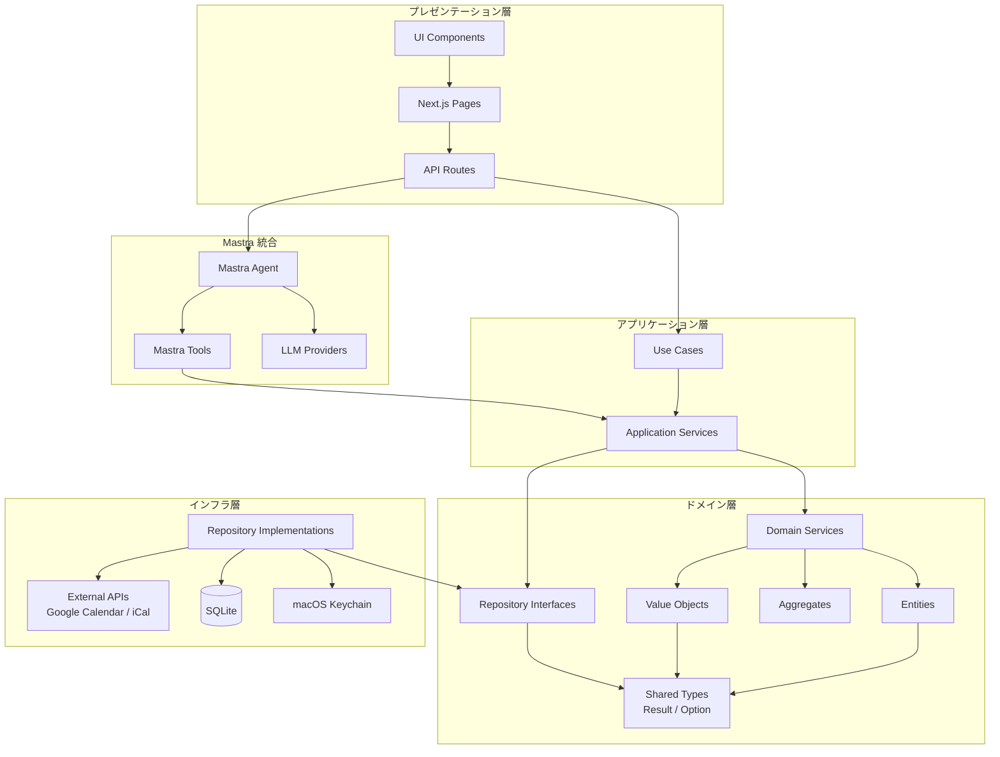
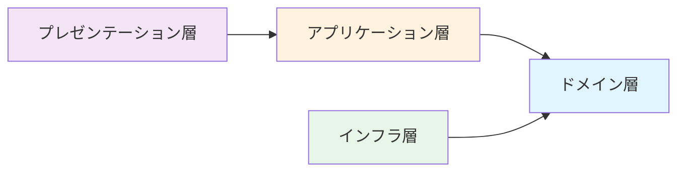
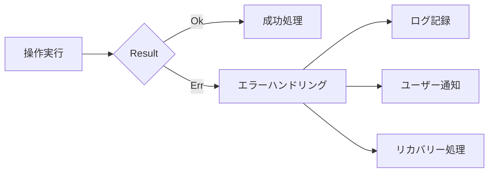

# Design Document - project-setup

## Overview

本文書は、miipaプロジェクトの初期セットアップに関する設計を定義する。Next.js (App Router) + Mastra + Panda CSS + Biome を用いた開発環境の構築、DDDレイヤーアーキテクチャ、関数型プログラミングの基盤型（Result型、Option型）の設計を含む。

miipaは一人社長向けのカレンダー統合AIアシスタントであり、「今日/今週の自分を30秒で把握」できるローカル実行ツールを目指す。本セットアップでは、その基盤となるプロジェクト構造と型システムを構築する。

## 使用ライブラリバージョン（2026年1月時点）

本プロジェクトで使用する主要ライブラリの最新バージョンを以下に明示する。

| ライブラリ | バージョン | 備考 |
|-----------|-----------|------|
| Next.js | 16.1.x | Turbopack File System Caching (stable)、Cache Components、React Compiler対応 |
| React | 19.2.x | `<Activity>`、`useEffectEvent`、View Transitions対応 |
| TypeScript | 5.9.x (stable) / 6.0.x (bridge) | 7.0 (Go-based native compiler) は2026年前半リリース予定 |
| Panda CSS | 1.8.x | 型安全なCSS-in-JS、ビルド時CSS生成、v1.0でメジャーアップデート |
| Park UI | 0.43.x | Ark UI 3.0 API対応、Panda CSS Preset |
| Biome | 2.3.x | 425以上のlintルール、type-aware linting対応 |
| Mastra | 1.0.x | v1.0 GAリリース済み、AI SDK v6対応 |
| better-sqlite3 | 12.6.x | Node.js v14.21.1以降対応、LTS版向けprebuilt binaries |
| keytar | 7.9.0 | macOS Keychain統合（最終更新: 2021年、安定版） |

### バージョン選定方針

- **安定性優先**: プロダクション利用を前提に、RC/betaよりも安定版を優先
- **セキュリティ**: セキュリティパッチが提供されるLTS/最新安定版を使用
- **互換性**: Next.js 16とReact 19.2の組み合わせを基準に依存関係を調整

### 注意事項

- TypeScript 7.0（Go-based native compiler）は2026年前半リリース予定。初期開発では5.9.x系を使用し、7.0リリース後に移行を検討
- Mastra v1.0がGAリリース済み。最新の1.0.x系を使用
- Panda CSS v1.0がメジャーアップデート済み。最新の1.8.x系を使用
- keytarは長期間更新がないが、macOS Keychain統合としては安定しており継続使用

## Steering Document Alignment

### Technical Standards (tech.md)

本設計は以下の技術標準に従う:

- **TypeScript**: strict モード有効、型安全性を最優先
- **関数型プログラミング**: Result/Option型による明示的なエラーハンドリング
- **DDD**: ドメイン層をインフラ層から分離、リポジトリパターンの採用
- **コーディング規約**: Biome による一貫したスタイル強制

### Project Structure (structure.md)

CLAUDE.md で定義されたディレクトリ構成に準拠:

```
miipa/
├── app/                    # Next.js App Router
├── lib/
│   ├── domain/            # ドメイン層
│   ├── application/       # アプリケーション層
│   ├── infrastructure/    # インフラ層
│   ├── mastra/           # Mastra AI 統合
│   └── config/           # 設定管理
└── components/           # UI コンポーネント
```

## Code Reuse Analysis

### Existing Components to Leverage

本プロジェクトは新規セットアップのため、外部ライブラリの活用を中心に設計する:

- **Next.js 15**: App Router、Server Components、API Routes
- **Mastra**: AI エージェント基盤（Vercel AI SDK ベース）
- **Panda CSS**: 型安全な CSS-in-JS
- **Park UI**: アクセシブルなUIコンポーネントプリセット
- **keytar**: macOS Keychain 統合
- **better-sqlite3**: 軽量SQLiteドライバ

### Integration Points

- **ファイルシステム**: `~/.miipa/` ディレクトリでの設定・データ永続化
- **macOS Keychain**: keytar を介した機密情報管理
- **LLM プロバイダ**: Mastra 経由での Claude/OpenAI/Ollama 接続

## Architecture

### アーキテクチャ概要

本設計では、DDDに基づくレイヤードアーキテクチャと関数型プログラミングの原則を組み合わせる。



### Modular Design Principles

- **Single File Responsibility**: 各ファイルは単一の明確な目的を持つ
  - 例: `result.ts` は Result 型のみ、`option.ts` は Option 型のみを定義
- **Component Isolation**: 小さく焦点を絞ったコンポーネントを作成
  - ドメインエンティティは独立したファイルに分離
- **Service Layer Separation**: データアクセス、ビジネスロジック、プレゼンテーションを分離
  - ドメイン層 → アプリケーション層 → プレゼンテーション層の一方向依存
- **Utility Modularity**: ユーティリティは単一目的のモジュールに分割
  - `shared/` 配下に共通型を集約

### 依存関係の方向



**重要**: ドメイン層はいかなる他の層にも依存しない。インフラ層がドメイン層のインターフェースに依存する（依存性逆転の原則）。

## Components and Interfaces

### Component 1: Result 型 (`lib/domain/shared/result.ts`)

**Purpose:** 成功/失敗を明示的に型で表現し、例外スローを避ける

**Interfaces:**

```typescript
// 型定義
type Ok<T> = { readonly _tag: 'Ok'; readonly value: T };
type Err<E> = { readonly _tag: 'Err'; readonly error: E };
type Result<T, E> = Ok<T> | Err<E>;

// コンストラクタ
function ok<T>(value: T): Ok<T>;
function err<E>(error: E): Err<E>;

// 型ガード
function isOk<T, E>(result: Result<T, E>): result is Ok<T>;
function isErr<T, E>(result: Result<T, E>): result is Err<E>;

// 変換関数
function map<T, U, E>(result: Result<T, E>, fn: (value: T) => U): Result<U, E>;
function flatMap<T, U, E>(result: Result<T, E>, fn: (value: T) => Result<U, E>): Result<U, E>;
function mapErr<T, E, F>(result: Result<T, E>, fn: (error: E) => F): Result<T, F>;

// 値の取り出し
function unwrap<T, E>(result: Result<T, E>): T;  // Err の場合は例外
function unwrapOr<T, E>(result: Result<T, E>, defaultValue: T): T;
function unwrapErr<T, E>(result: Result<T, E>): E;  // Ok の場合は例外

// パターンマッチング
function match<T, E, U>(
  result: Result<T, E>,
  handlers: { ok: (value: T) => U; err: (error: E) => U }
): U;

// 複数Result の合成
function all<T, E>(results: Result<T, E>[]): Result<T[], E>;
function fromPromise<T, E = Error>(promise: Promise<T>): Promise<Result<T, E>>;
```

**Dependencies:** なし（純粋なユーティリティ型）

**Reuses:** なし（基盤型として新規作成）

### Component 2: Option 型 (`lib/domain/shared/option.ts`)

**Purpose:** null/undefined の代わりに値の有無を型で表現する

**Interfaces:**

```typescript
// 型定義
type Some<T> = { readonly _tag: 'Some'; readonly value: T };
type None = { readonly _tag: 'None' };
type Option<T> = Some<T> | None;

// コンストラクタ
function some<T>(value: T): Some<T>;
function none(): None;
function fromNullable<T>(value: T | null | undefined): Option<T>;

// 型ガード
function isSome<T>(option: Option<T>): option is Some<T>;
function isNone<T>(option: Option<T>): option is None;

// 変換関数
function map<T, U>(option: Option<T>, fn: (value: T) => U): Option<U>;
function flatMap<T, U>(option: Option<T>, fn: (value: T) => Option<U>): Option<U>;
function filter<T>(option: Option<T>, predicate: (value: T) => boolean): Option<T>;

// 値の取り出し
function unwrap<T>(option: Option<T>): T;  // None の場合は例外
function unwrapOr<T>(option: Option<T>, defaultValue: T): T;
function unwrapOrElse<T>(option: Option<T>, fn: () => T): T;

// パターンマッチング
function match<T, U>(
  option: Option<T>,
  handlers: { some: (value: T) => U; none: () => U }
): U;

// Option と Result の変換
function toResult<T, E>(option: Option<T>, error: E): Result<T, E>;
function fromResult<T, E>(result: Result<T, E>): Option<T>;
```

**Dependencies:** `result.ts`（toResult/fromResult で相互変換）

**Reuses:** なし（基盤型として新規作成）

### Component 3: アプリケーションエラー型 (`lib/domain/shared/errors.ts`)

**Purpose:** アプリケーション全体で使用する共通エラー型を定義

**Interfaces:**

```typescript
// 基底エラー型
interface AppError {
  readonly code: string;
  readonly message: string;
  readonly cause?: unknown;
}

// 設定関連エラー
interface ConfigError extends AppError {
  readonly code: 'CONFIG_NOT_FOUND' | 'CONFIG_PARSE_ERROR' | 'CONFIG_VALIDATION_ERROR';
}

// ファイルシステムエラー
interface FileSystemError extends AppError {
  readonly code: 'FILE_NOT_FOUND' | 'FILE_READ_ERROR' | 'FILE_WRITE_ERROR' | 'DIRECTORY_CREATE_ERROR';
  readonly path: string;
}

// Keychain エラー
interface KeychainError extends AppError {
  readonly code: 'KEYCHAIN_ACCESS_DENIED' | 'KEYCHAIN_NOT_FOUND' | 'KEYCHAIN_WRITE_ERROR';
  readonly service: string;
}

// エラーファクトリ関数
function configError(code: ConfigError['code'], message: string, cause?: unknown): ConfigError;
function fileSystemError(code: FileSystemError['code'], path: string, message: string, cause?: unknown): FileSystemError;
function keychainError(code: KeychainError['code'], service: string, message: string, cause?: unknown): KeychainError;
```

**Dependencies:** なし

**Reuses:** なし

### Component 4: 設定管理 (`lib/config/`)

**Purpose:** アプリケーション設定の読み込み・保存を管理

**ファイル構成:**

```
lib/config/
├── index.ts              # 公開API（re-export）
├── types.ts              # 設定の型定義
├── loader.ts             # 設定ファイルの読み込み
├── validator.ts          # 設定の検証
└── paths.ts              # パス定数
```

**Interfaces:**

```typescript
// lib/config/types.ts
interface AppConfig {
  readonly version: string;
  readonly llm: LLMConfig;
  readonly calendars: CalendarConfig[];
}

interface LLMConfig {
  readonly provider: 'claude' | 'openai' | 'ollama';
  readonly model?: string;
}

interface CalendarConfig {
  readonly id: string;
  readonly name: string;
  readonly type: 'google' | 'ical';
  readonly url?: string;  // iCal の場合
}

// lib/config/loader.ts
function loadConfig(): Promise<Result<AppConfig, ConfigError>>;
function saveConfig(config: AppConfig): Promise<Result<void, ConfigError>>;
function initializeConfig(): Promise<Result<AppConfig, ConfigError>>;

// lib/config/paths.ts
const MIIPA_DIR: string;  // ~/.miipa
const CONFIG_PATH: string;  // ~/.miipa/config.json
const DB_PATH: string;      // ~/.miipa/db.sqlite
```

**Dependencies:**
- `lib/domain/shared/result.ts`
- `lib/domain/shared/errors.ts`

### Component 5: Keychain 統合 (`lib/infrastructure/keychain/`)

**Purpose:** macOS Keychain を介した機密情報の安全な管理

**ファイル構成:**

```
lib/infrastructure/keychain/
├── index.ts              # 公開API
├── types.ts              # 型定義
└── keytar-adapter.ts     # keytar ラッパー
```

**Interfaces:**

```typescript
// lib/infrastructure/keychain/types.ts
type SecretKey = 'google-oauth-token' | 'openai-api-key' | 'anthropic-api-key';

// lib/infrastructure/keychain/index.ts
function getSecret(key: SecretKey): Promise<Result<Option<string>, KeychainError>>;
function setSecret(key: SecretKey, value: string): Promise<Result<void, KeychainError>>;
function deleteSecret(key: SecretKey): Promise<Result<void, KeychainError>>;
```

**Dependencies:**
- `keytar` (npm パッケージ)
- `lib/domain/shared/result.ts`
- `lib/domain/shared/option.ts`
- `lib/domain/shared/errors.ts`

### Component 6: Mastra Agent 基盤 (`lib/mastra/`)

**Purpose:** AI エージェントの基盤設定

**ファイル構成:**

```
lib/mastra/
├── index.ts              # Mastra インスタンス初期化
├── agent.ts              # Agent 定義
└── tools/
    └── index.ts          # Tools エクスポート
```

**Interfaces:**

```typescript
// lib/mastra/index.ts
import { Mastra } from '@mastra/core';

export const mastra: Mastra;

// lib/mastra/agent.ts
import { Agent } from '@mastra/core';

export const miipaAgent: Agent;
```

**Dependencies:**
- `@mastra/core`
- `lib/config/` (LLM 設定の読み込み)

### Component 7: データベース基盤 (`lib/infrastructure/db/`)

**Purpose:** SQLite データベースの初期化と基本操作

**ファイル構成:**

```
lib/infrastructure/db/
├── index.ts              # DB 初期化・接続管理
├── types.ts              # 型定義
└── migrations/
    └── 001_initial.sql   # 初期スキーマ
```

**Interfaces:**

```typescript
// lib/infrastructure/db/index.ts
import Database from 'better-sqlite3';

function initializeDatabase(): Result<Database, FileSystemError>;
function getDatabase(): Option<Database>;
function closeDatabase(): void;
```

**Dependencies:**
- `better-sqlite3`
- `lib/config/paths.ts`
- `lib/domain/shared/result.ts`
- `lib/domain/shared/option.ts`

## Data Models

### Model 1: AppConfig（アプリケーション設定）

```typescript
interface AppConfig {
  readonly version: string;           // 設定ファイルバージョン (例: "1.0.0")
  readonly llm: LLMConfig;            // LLM プロバイダ設定
  readonly calendars: CalendarConfig[]; // カレンダー設定リスト
  readonly ui: UIConfig;              // UI 設定
}

interface LLMConfig {
  readonly provider: 'claude' | 'openai' | 'ollama';
  readonly model?: string;            // モデル名（省略時はプロバイダデフォルト）
  readonly baseUrl?: string;          // Ollama 用カスタムURL
}

interface CalendarConfig {
  readonly id: string;                // 一意識別子 (UUID)
  readonly name: string;              // 表示名
  readonly type: 'google' | 'ical';   // カレンダータイプ
  readonly enabled: boolean;          // 有効/無効
  readonly color?: string;            // 表示色
  readonly url?: string;              // iCal URL（type='ical' の場合）
  readonly googleAccountId?: string;  // Google アカウントID（type='google' の場合）
}

interface UIConfig {
  readonly theme: 'light' | 'dark' | 'system';
  readonly locale: 'ja' | 'en';
}
```

**保存場所:** `~/.miipa/config.json`

### Model 2: 共有型定義

```typescript
// lib/domain/shared/types.ts

// ブランド型（型安全なID）
type Brand<K, T> = K & { readonly __brand: T };

type CalendarId = Brand<string, 'CalendarId'>;
type EventId = Brand<string, 'EventId'>;

// 時間関連
interface TimeRange {
  readonly start: Date;
  readonly end: Date;
}

type DateRange = 'today' | 'this-week' | 'this-month' | TimeRange;

// ユーティリティ型
type NonEmptyArray<T> = [T, ...T[]];
```

## Error Handling

### Error Handling Strategy

本プロジェクトでは、**例外をスローしない**関数型アプローチを採用する。



### Error Scenarios

#### 1. 設定ファイル読み込みエラー

**Scenario:** `~/.miipa/config.json` が存在しない、または破損している

**Handling:**
```typescript
const configResult = await loadConfig();
match(configResult, {
  ok: (config) => initializeApp(config),
  err: (error) => {
    switch (error.code) {
      case 'CONFIG_NOT_FOUND':
        // デフォルト設定で初期化
        return initializeConfig();
      case 'CONFIG_PARSE_ERROR':
        // バックアップを試行、ユーザーに警告
        return recoverFromBackup();
      case 'CONFIG_VALIDATION_ERROR':
        // 検証エラーをユーザーに表示
        return showValidationErrors(error);
    }
  }
});
```

**User Impact:** 初回起動時はセットアップウィザードを表示。破損時は警告とリカバリー選択肢を提示。

#### 2. Keychain アクセスエラー

**Scenario:** macOS Keychain へのアクセスが拒否された

**Handling:**
```typescript
const secretResult = await getSecret('google-oauth-token');
match(secretResult, {
  ok: (optionSecret) =>
    match(optionSecret, {
      some: (secret) => useSecret(secret),
      none: () => promptForCredentials()
    }),
  err: (error) => {
    if (error.code === 'KEYCHAIN_ACCESS_DENIED') {
      // システム環境設定を開くよう案内
      showKeychainPermissionGuide();
    }
  }
});
```

**User Impact:** Keychain 権限の設定方法を案内するダイアログを表示。

#### 3. データベース初期化エラー

**Scenario:** SQLite データベースの作成・接続に失敗

**Handling:**
```typescript
const dbResult = initializeDatabase();
match(dbResult, {
  ok: (db) => startApp(db),
  err: (error) => {
    // ディレクトリ作成の再試行
    const dirResult = await ensureDirectory(MIIPA_DIR);
    if (isErr(dirResult)) {
      showFatalError('データ保存先を作成できません', error);
      process.exit(1);
    }
    // 再試行
    return initializeDatabase();
  }
});
```

**User Impact:** 致命的エラーの場合は明確なエラーメッセージと解決策を表示。

#### 4. LLM プロバイダ接続エラー

**Scenario:** Claude/OpenAI/Ollama への接続に失敗

**Handling:**
```typescript
const responseResult = await agent.generate(prompt);
match(responseResult, {
  ok: (response) => displayResponse(response),
  err: (error) => {
    // フォールバック: 別プロバイダを試行（設定されている場合）
    // または、オフラインモードで基本機能のみ提供
    showOfflineMode();
  }
});
```

**User Impact:** 接続エラー時はオフラインモードで基本的なカレンダー表示のみ提供。

## Testing Strategy

### Unit Testing

**対象:**
- `lib/domain/shared/result.ts` - Result 型の全ユーティリティ関数
- `lib/domain/shared/option.ts` - Option 型の全ユーティリティ関数
- `lib/config/validator.ts` - 設定バリデーション
- 純粋関数全般

**フレームワーク:** Vitest

**テスト例:**
```typescript
// result.test.ts
import { describe, it, expect } from 'vitest';
import { ok, err, isOk, isErr, map, flatMap, match } from './result';

describe('Result', () => {
  describe('map', () => {
    it('Ok の場合は関数を適用する', () => {
      const result = ok(5);
      const mapped = map(result, (x) => x * 2);
      expect(isOk(mapped) && mapped.value).toBe(10);
    });

    it('Err の場合はそのまま返す', () => {
      const result = err('error');
      const mapped = map(result, (x: number) => x * 2);
      expect(isErr(mapped) && mapped.error).toBe('error');
    });
  });

  describe('match', () => {
    it('Ok の場合は ok ハンドラを呼ぶ', () => {
      const result = ok(5);
      const value = match(result, {
        ok: (x) => `success: ${x}`,
        err: (e) => `error: ${e}`
      });
      expect(value).toBe('success: 5');
    });
  });
});
```

### Integration Testing

**対象:**
- `lib/config/loader.ts` - ファイルシステムとの統合
- `lib/infrastructure/keychain/` - Keychain との統合
- `lib/infrastructure/db/` - SQLite との統合

**アプローチ:**
- テスト用の一時ディレクトリを使用
- モック Keychain（CI環境用）
- テスト用 SQLite インメモリデータベース

**テスト例:**
```typescript
// config-loader.test.ts
import { describe, it, expect, beforeEach, afterEach } from 'vitest';
import { mkdtemp, rm } from 'fs/promises';
import { tmpdir } from 'os';
import { join } from 'path';
import { loadConfig, saveConfig } from './loader';
import { isOk, isErr } from '../domain/shared/result';

describe('Config Loader', () => {
  let testDir: string;

  beforeEach(async () => {
    testDir = await mkdtemp(join(tmpdir(), 'miipa-test-'));
    // テスト用のパスを設定
  });

  afterEach(async () => {
    await rm(testDir, { recursive: true });
  });

  it('設定ファイルを保存して読み込める', async () => {
    const config = { version: '1.0.0', llm: { provider: 'claude' }, calendars: [] };
    const saveResult = await saveConfig(config);
    expect(isOk(saveResult)).toBe(true);

    const loadResult = await loadConfig();
    expect(isOk(loadResult) && loadResult.value).toEqual(config);
  });
});
```

### End-to-End Testing

**対象:**
- 初回起動フロー
- 設定ウィザード
- カレンダー表示（モックデータ使用）

**フレームワーク:** Playwright

**テストシナリオ:**

1. **初回起動テスト**
   - アプリケーション起動
   - セットアップウィザード表示確認
   - LLM プロバイダ選択
   - 設定保存確認

2. **設定変更テスト**
   - 設定画面遷移
   - 値の変更
   - 保存と反映確認

## Directory Structure

最終的なディレクトリ構成:

```
miipa/
├── app/
│   ├── layout.tsx                 # ルートレイアウト
│   ├── page.tsx                   # メイン画面
│   ├── setup/
│   │   └── page.tsx              # セットアップウィザード
│   └── api/
│       ├── calendar/
│       │   └── route.ts          # カレンダー API
│       ├── ask/
│       │   └── route.ts          # AI 質問 API
│       └── auth/
│           └── callback/
│               └── route.ts      # OAuth コールバック
├── components/
│   ├── ui/                       # Park UI ベースコンポーネント
│   └── features/                 # 機能別コンポーネント
├── lib/
│   ├── domain/
│   │   ├── shared/
│   │   │   ├── result.ts         # Result<T, E> 型
│   │   │   ├── option.ts         # Option<T> 型
│   │   │   ├── errors.ts         # 共通エラー型
│   │   │   └── types.ts          # 共通型定義
│   │   └── calendar/
│   │       ├── entities/         # エンティティ（将来実装）
│   │       ├── value-objects/    # 値オブジェクト（将来実装）
│   │       └── repository.ts     # リポジトリインターフェース（将来実装）
│   ├── application/
│   │   └── .gitkeep             # 将来のユースケース用
│   ├── infrastructure/
│   │   ├── keychain/
│   │   │   ├── index.ts
│   │   │   ├── types.ts
│   │   │   └── keytar-adapter.ts
│   │   ├── db/
│   │   │   ├── index.ts
│   │   │   ├── types.ts
│   │   │   └── migrations/
│   │   │       └── 001_initial.sql
│   │   └── calendar/            # 将来実装
│   │       ├── google.ts
│   │       └── ical.ts
│   ├── mastra/
│   │   ├── index.ts
│   │   ├── agent.ts
│   │   └── tools/
│   │       └── index.ts
│   └── config/
│       ├── index.ts
│       ├── types.ts
│       ├── loader.ts
│       ├── validator.ts
│       └── paths.ts
├── styled-system/               # Panda CSS 生成ファイル
├── public/
│   └── meerkat.svg             # ミーアキャットアイコン
├── biome.json
├── panda.config.ts
├── next.config.ts
├── package.json
├── tsconfig.json
└── vitest.config.ts
```

## Implementation Notes

### パッケージ依存関係

```json
{
  "dependencies": {
    "next": "^16.1.0",
    "react": "^19.2.0",
    "react-dom": "^19.2.0",
    "@mastra/core": "^1.0.4",
    "@mastra/ai-sdk": "^1.0.0",
    "@park-ui/panda-preset": "^0.43.1",
    "@ark-ui/react": "^3.0.0",
    "keytar": "^7.9.0",
    "better-sqlite3": "^12.6.2",
    "zod": "^3.24.0"
  },
  "devDependencies": {
    "@biomejs/biome": "^2.3.0",
    "@pandacss/dev": "^1.8.1",
    "typescript": "^5.9.3",
    "vitest": "^3.0.0",
    "@playwright/test": "^1.50.0",
    "@types/better-sqlite3": "^7.6.13",
    "@types/node": "^22.0.0",
    "@types/react": "^19.0.0",
    "@types/react-dom": "^19.0.0"
  }
}
```

### 初期化順序

1. `~/.miipa/` ディレクトリの作成
2. `config.json` の読み込み/初期化
3. SQLite データベースの初期化
4. Mastra Agent の初期化
5. Next.js サーバーの起動

### 設定ファイルの初期値

```json
{
  "version": "1.0.0",
  "llm": {
    "provider": "claude"
  },
  "calendars": [],
  "ui": {
    "theme": "system",
    "locale": "ja"
  }
}
```
