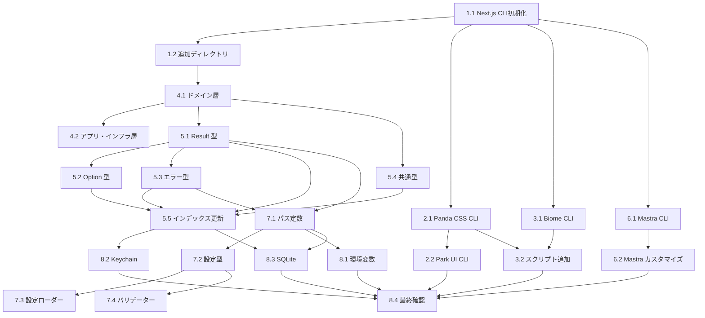

# Tasks Document - project-setup

## Overview

SoloDayプロジェクトの初期セットアップに必要なタスクを定義する。Next.js (App Router) + Mastra + Panda CSS + Biome による開発環境構築、DDDレイヤーアーキテクチャの初期化、関数型プログラミング基盤型（Result型、Option型）の実装を含む。

**重要**: 各種開発環境やパッケージのセットアップは公式CLIコマンドを使用すること。ファイルを一から手動作成しない。

---

## Phase 1: Next.js プロジェクト初期化

- [x] 1.1. Next.js プロジェクトの作成
  - Files: `package.json`, `next.config.ts`, `tsconfig.json`, `app/layout.tsx`, `app/page.tsx`
  - **公式CLIコマンドでプロジェクトを生成**
  - TypeScript strict モードを有効化
  - Purpose: モダンなReactアプリケーションの基盤を構築
  - _Leverage: なし（新規作成）_
  - _Requirements: 1.1, 1.2, 1.3, 1.4_
  - _Prompt: Implement the task for spec project-setup, first run spec-workflow-guide to get the workflow guide then implement the task: Role: Next.js Developer specializing in App Router and TypeScript | Task: 1) Run `npx create-next-app@latest . --typescript --tailwind=false --eslint=false --app --src-dir=false --import-alias="@/*" --use-npm` to create the project 2) Customize tsconfig.json to enable strict mode if not already enabled 3) Verify the generated files match design.md specifications | Restrictions: Use the official CLI command, do not manually create package.json or next.config.ts, customize only after CLI generation | Success: `npm run dev` starts server on localhost:3000, `npm run build` completes without errors, TypeScript strict mode is enabled in tsconfig.json | After completing, mark task as in-progress in tasks.md with `[-]`, then use log-implementation tool to record implementation details, then mark as complete with `[x]`_

- [x] 1.2. 追加ディレクトリ構成の作成
  - Files: `app/api/.gitkeep`, `components/.gitkeep`, `lib/.gitkeep`
  - CLIが生成したファイルを確認し、不足しているディレクトリのみ追加
  - Purpose: Next.js App Router の基本構造を完成させる
  - _Leverage: 1.1で作成した Next.js プロジェクト_
  - _Requirements: 1.3, 5.1_
  - _Prompt: Implement the task for spec project-setup, first run spec-workflow-guide to get the workflow guide then implement the task: Role: Next.js Developer with expertise in App Router architecture | Task: Review the files generated by create-next-app in task 1.1, then create only the missing directories: app/api/, components/, lib/ with .gitkeep files. Update app/layout.tsx to use Japanese locale (lang="ja") if not already set | Restrictions: Do not recreate files that already exist, only add missing directories, use Japanese comments | Success: All required directories exist, layout has proper Japanese locale, TypeScript compiles without errors | After completing, mark task as in-progress in tasks.md with `[-]`, then use log-implementation tool to record implementation details, then mark as complete with `[x]`_

---

## Phase 2: Panda CSS + Park UI セットアップ

- [x] 2.1. Panda CSS のインストールと初期設定
  - Files: `panda.config.ts`, `postcss.config.cjs`, `app/globals.css`
  - **公式CLIコマンドでPanda CSSを初期化**
  - 出力先を `styled-system/` に設定
  - Purpose: 型安全なCSS-in-JSの基盤を構築
  - _Leverage: 1.1で作成した package.json_
  - _Requirements: 2.1, 2.3, 2.4_
  - _Prompt: Implement the task for spec project-setup, first run spec-workflow-guide to get the workflow guide then implement the task: Role: CSS-in-JS Developer specializing in Panda CSS | Task: 1) Run `npm install -D @pandacss/dev` 2) Run `npx panda init --postcss` to generate initial config files 3) Customize panda.config.ts: set outdir to 'styled-system', add jsxFramework: 'react', configure include paths 4) Add styled-system/ to .gitignore 5) Update app/globals.css to import Panda layers | Restrictions: Use official CLI commands, customize config after generation, do not manually create postcss.config.cjs | Success: `npx panda codegen` generates styled-system/, styles are type-safe, hot reload works in development | After completing, mark task as in-progress in tasks.md with `[-]`, then use log-implementation tool to record implementation details, then mark as complete with `[x]`_

- [x] 2.2. Park UI プリセットの統合
  - Files: `panda.config.ts` (modify), `lib/park-ui/`
  - **Park UI CLIでコンポーネントを初期化**
  - Panda CSS 設定に Park UI プリセットを追加
  - Purpose: アクセシブルなUIコンポーネント基盤を構築
  - _Leverage: 2.1で作成した panda.config.ts_
  - _Requirements: 2.2, 2.3_
  - _Prompt: Implement the task for spec project-setup, first run spec-workflow-guide to get the workflow guide then implement the task: Role: UI Developer specializing in Park UI and component libraries | Task: 1) Run `npm install @park-ui/panda-preset @ark-ui/react` 2) Run `npx @park-ui/cli init` to initialize Park UI (select Panda CSS, React, and preferred style) 3) Update panda.config.ts to include Park UI preset in presets array 4) Run `npx panda codegen` to regenerate styled-system with Park UI | Restrictions: Use official CLI commands, follow CLI prompts for configuration, version as specified in design.md | Success: Park UI components are available, recipes are type-safe, codegen includes Park UI styles | After completing, mark task as in-progress in tasks.md with `[-]`, then use log-implementation tool to record implementation details, then mark as complete with `[x]`_

---

## Phase 3: Biome 設定

- [x] 3.1. Biome のインストールと設定
  - Files: `biome.json`
  - **公式CLIコマンドでBiomeを初期化**
  - import ソート、未使用変数の検出を有効化
  - Purpose: 高速な lint/format 環境を構築
  - _Leverage: 1.1で作成した package.json_
  - _Requirements: 3.1, 3.2, 3.3, 3.4_
  - _Prompt: Implement the task for spec project-setup, first run spec-workflow-guide to get the workflow guide then implement the task: Role: DevOps Engineer specializing in code quality tools | Task: 1) Run `npm install -D @biomejs/biome` 2) Run `npx @biomejs/biome init` to generate biome.json 3) Customize biome.json: enable organizeImports, configure ignore patterns for styled-system/ and .next/, set indentation preferences | Restrictions: Use official CLI command to generate base config, customize after generation, do not use ESLint/Prettier | Success: `npx biome check .` runs without errors on clean code, `npx biome check --write .` auto-fixes issues, clear error messages | After completing, mark task as in-progress in tasks.md with `[-]`, then use log-implementation tool to record implementation details, then mark as complete with `[x]`_

- [x] 3.2. package.json スクリプトの追加
  - Files: `package.json` (modify)
  - lint, format スクリプトを追加
  - prepare スクリプトで panda codegen を実行
  - Purpose: 開発ワークフローを効率化
  - _Leverage: 3.1で作成した biome.json, 2.1で作成した panda.config.ts_
  - _Requirements: 7.3, 7.4_
  - _Prompt: Implement the task for spec project-setup, first run spec-workflow-guide to get the workflow guide then implement the task: Role: Node.js Developer with expertise in npm scripts | Task: Add scripts to package.json: "lint": "biome check .", "lint:fix": "biome check --write .", "prepare": "panda codegen", "dev": existing + ensure panda watch, "build": panda codegen && next build | Restrictions: Use npx for biome commands, ensure prepare runs on npm install, do not duplicate existing scripts | Success: All scripts execute correctly, lint catches errors, prepare generates styled-system/ | After completing, mark task as in-progress in tasks.md with `[-]`, then use log-implementation tool to record implementation details, then mark as complete with `[x]`_

---

## Phase 4: DDD レイヤーディレクトリ構成

- [x] 4.1. ドメイン層ディレクトリの作成
  - Files: `lib/domain/shared/`, `lib/domain/calendar/`, `.gitkeep` files, `lib/domain/shared/index.ts`
  - ドメイン層のディレクトリ構造を作成
  - shared/ と calendar/ サブディレクトリを初期化
  - 公開APIのインデックスファイルを作成
  - Purpose: DDDに基づくドメイン層の基盤を構築
  - _Leverage: なし（新規作成）_
  - _Requirements: 5.1, 8.1, 8.5_
  - _Prompt: Implement the task for spec project-setup, first run spec-workflow-guide to get the workflow guide then implement the task: Role: Software Architect specializing in DDD and clean architecture | Task: Create lib/domain/shared/ (for Result, Option, errors, types) and lib/domain/calendar/ (for entities/, value-objects/, repository.ts placeholder), add .gitkeep files, create index.ts for re-exports | Restrictions: Do not implement actual domain logic yet, just directory structure, use Japanese comments for documentation | Success: Directory structure matches design.md, index.ts exports are prepared, TypeScript recognizes paths | After completing, mark task as in-progress in tasks.md with `[-]`, then use log-implementation tool to record implementation details, then mark as complete with `[x]`_

- [x] 4.2. アプリケーション層とインフラ層ディレクトリの作成
  - Files: `lib/application/`, `lib/infrastructure/keychain/`, `lib/infrastructure/db/`, `lib/infrastructure/calendar/`, `.gitkeep` files
  - アプリケーションサービス用ディレクトリを作成
  - インフラ層のサブディレクトリ（keychain, db, calendar）を作成
  - Purpose: レイヤードアーキテクチャの基盤を構築
  - _Leverage: 4.1で作成したディレクトリ構造_
  - _Requirements: 5.1, 8.6_
  - _Prompt: Implement the task for spec project-setup, first run spec-workflow-guide to get the workflow guide then implement the task: Role: Software Architect specializing in layered architecture | Task: Create lib/application/ for use cases, lib/infrastructure/keychain/, lib/infrastructure/db/, lib/infrastructure/calendar/ for external integrations, add .gitkeep files | Restrictions: Do not implement actual infrastructure code yet, maintain clear separation between layers, add Japanese comments explaining each directory's purpose | Success: Directory structure matches design.md, clear documentation of layer responsibilities, no cross-layer imports in placeholder files | After completing, mark task as in-progress in tasks.md with `[-]`, then use log-implementation tool to record implementation details, then mark as complete with `[x]`_

---

## Phase 5: Result 型・Option 型の実装

- [x] 5.1. Result 型の実装
  - Files: `lib/domain/shared/result.ts`
  - Result<T, E> 型を定義（Ok, Err）
  - ok(), err(), isOk(), isErr() コンストラクタと型ガードを実装
  - map(), flatMap(), mapErr() 変換関数を実装
  - unwrap(), unwrapOr(), match() ユーティリティを実装
  - all(), fromPromise() 合成関数を実装
  - Purpose: 例外をスローしない関数型エラーハンドリングの基盤
  - _Leverage: なし（基盤型として新規作成）_
  - _Requirements: 8.1_
  - _Prompt: Implement the task for spec project-setup, first run spec-workflow-guide to get the workflow guide then implement the task: Role: TypeScript Developer specializing in functional programming and type systems | Task: Implement Result<T, E> type following design.md Component 1 specification exactly. Create Ok<T>, Err<E> types with readonly _tag discriminator, implement all utility functions with proper type inference | Restrictions: Use readonly properties only, ensure type narrowing works with isOk/isErr guards, do not throw exceptions except in unwrap when Err, add Japanese JSDoc comments | Success: All functions are type-safe, pattern matching works correctly, Result chains with map/flatMap, fromPromise handles async errors | After completing, mark task as in-progress in tasks.md with `[-]`, then use log-implementation tool to record implementation details, then mark as complete with `[x]`_

- [x] 5.2. Option 型の実装
  - Files: `lib/domain/shared/option.ts`
  - Option<T> 型を定義（Some, None）
  - some(), none(), fromNullable() コンストラクタを実装
  - isSome(), isNone() 型ガードを実装
  - map(), flatMap(), filter() 変換関数を実装
  - unwrap(), unwrapOr(), match() ユーティリティを実装
  - toResult(), fromResult() 変換関数を実装
  - Purpose: null/undefined を型安全に扱う基盤
  - _Leverage: 5.1で作成した result.ts_
  - _Requirements: 8.2_
  - _Prompt: Implement the task for spec project-setup, first run spec-workflow-guide to get the workflow guide then implement the task: Role: TypeScript Developer specializing in functional programming | Task: Implement Option<T> type following design.md Component 2 specification exactly. Create Some<T>, None types with readonly _tag discriminator, implement all utility functions, integrate with Result type via toResult/fromResult | Restrictions: Use readonly properties only, ensure type narrowing works with isSome/isNone guards, import Result type from result.ts, add Japanese JSDoc comments | Success: All functions are type-safe, pattern matching works correctly, Option chains with map/flatMap, toResult/fromResult convert correctly | After completing, mark task as in-progress in tasks.md with `[-]`, then use log-implementation tool to record implementation details, then mark as complete with `[x]`_

- [x] 5.3. アプリケーションエラー型の実装
  - Files: `lib/domain/shared/errors.ts`
  - AppError 基底インターフェースを定義
  - ConfigError, FileSystemError, KeychainError を定義
  - エラーファクトリ関数を実装
  - Purpose: アプリケーション全体で一貫したエラー型を提供
  - _Leverage: なし（新規作成）_
  - _Requirements: 8.3_
  - _Prompt: Implement the task for spec project-setup, first run spec-workflow-guide to get the workflow guide then implement the task: Role: TypeScript Developer specializing in error handling patterns | Task: Implement error types following design.md Component 3 specification. Create AppError base interface, ConfigError, FileSystemError, KeychainError with specific error codes, implement factory functions | Restrictions: Use readonly properties, error codes must be string literal unions, include cause for error chaining, add Japanese error messages | Success: Error types are discriminated by code, factory functions create correct error objects, errors are serializable | After completing, mark task as in-progress in tasks.md with `[-]`, then use log-implementation tool to record implementation details, then mark as complete with `[x]`_

- [x] 5.4. 共通型定義の実装
  - Files: `lib/domain/shared/types.ts`
  - Brand 型（型安全なID）を定義
  - CalendarId, EventId ブランド型を定義
  - TimeRange, DateRange 型を定義
  - NonEmptyArray ユーティリティ型を定義
  - Purpose: ドメイン全体で使用する共通型を提供
  - _Leverage: なし（新規作成）_
  - _Requirements: 8.4_
  - _Prompt: Implement the task for spec project-setup, first run spec-workflow-guide to get the workflow guide then implement the task: Role: TypeScript Developer specializing in branded types and type-level programming | Task: Implement shared types following design.md Data Models section. Create Brand<K, T> utility type, CalendarId/EventId branded types, TimeRange interface with readonly Date properties, DateRange union type, NonEmptyArray type | Restrictions: Use readonly properties, Brand type must prevent accidental string assignment, add type guards for branded types if needed, add Japanese JSDoc comments | Success: Branded types prevent type confusion, TimeRange is immutable, NonEmptyArray ensures at least one element | After completing, mark task as in-progress in tasks.md with `[-]`, then use log-implementation tool to record implementation details, then mark as complete with `[x]`_

- [x] 5.5. ドメイン共有モジュールのインデックス更新
  - Files: `lib/domain/shared/index.ts`
  - 全ての共有型とユーティリティを re-export
  - 公開APIを整理
  - Purpose: ドメイン共有モジュールの使いやすいインターフェースを提供
  - _Leverage: 5.1-5.4で作成したファイル_
  - _Requirements: 8.1, 8.2, 8.3, 8.4_
  - _Prompt: Implement the task for spec project-setup, first run spec-workflow-guide to get the workflow guide then implement the task: Role: TypeScript Developer specializing in module organization | Task: Update lib/domain/shared/index.ts to re-export all types and functions from result.ts, option.ts, errors.ts, types.ts with organized exports | Restrictions: Use named exports for tree-shaking, group exports by category, do not re-export internal implementation details, add module-level Japanese JSDoc comment | Success: Single import point for all shared domain types, tree-shaking works correctly, TypeScript auto-complete shows all exports | After completing, mark task as in-progress in tasks.md with `[-]`, then use log-implementation tool to record implementation details, then mark as complete with `[x]`_

---

## Phase 6: Mastra 基盤設定

- [x] 6.1. Mastra の初期化
  - Files: `package.json` (modify), `mastra/` directory
  - **公式CLIコマンドでMastraを初期化**
  - 必要なパッケージをインストール
  - Purpose: AI エージェント機能の基盤を準備
  - _Leverage: 1.1で作成した package.json_
  - _Requirements: 4.1_
  - _Prompt: Implement the task for spec project-setup, first run spec-workflow-guide to get the workflow guide then implement the task: Role: Node.js Developer with expertise in Mastra framework | Task: 1) Run `npm install @mastra/core @ai-sdk/anthropic` to install Mastra and AI provider 2) Run `npx mastra init` to initialize Mastra in the existing project (follow CLI prompts) 3) Review generated files and customize as needed for SoloDay requirements | Restrictions: Use official CLI command, follow CLI prompts for configuration, ensure compatibility with Next.js 16 | Success: Mastra initialized without conflicts, import statements work, mastra directory structure is created | After completing, mark task as in-progress in tasks.md with `[-]`, then use log-implementation tool to record implementation details, then mark as complete with `[x]`_

- [x] 6.2. Mastra Agent 設定のカスタマイズ
  - Files: `mastra/agents/index.ts` or generated agent file, `lib/mastra/tools/index.ts`
  - CLIが生成したAgent定義をSoloDay用にカスタマイズ
  - Tools ディレクトリを初期化
  - Purpose: Mastra AI 統合の基盤を構築
  - _Leverage: 6.1で初期化した Mastra_
  - _Requirements: 4.1, 4.2, 4.3_
  - _Prompt: Implement the task for spec project-setup, first run spec-workflow-guide to get the workflow guide then implement the task: Role: AI/ML Engineer with expertise in Mastra framework | Task: Review the files generated by `mastra init` in task 6.1, customize Agent configuration for SoloDay (calendar assistant persona), create lib/mastra/tools/index.ts for future tool exports if not already created by CLI | Restrictions: Do not implement actual AI logic yet, use placeholder LLM configuration, ensure types are correct, add Japanese comments explaining structure | Success: Agent is configured with SoloDay persona, tools/index.ts is ready for tool additions | After completing, mark task as in-progress in tasks.md with `[-]`, then use log-implementation tool to record implementation details, then mark as complete with `[x]`_

---

## Phase 7: データ保存基盤（~/.soloday/）

- [x] 7.1. 設定パス定数とディレクトリ初期化
  - Files: `lib/config/paths.ts`, `lib/config/index.ts`
  - SOLODAY_DIR, CONFIG_PATH, DB_PATH 定数を定義
  - ensureDirectory() 関数を実装
  - Purpose: データ保存先の一元管理
  - _Leverage: 5.1で作成した result.ts, 5.3で作成した errors.ts_
  - _Requirements: 6.1, 6.2_
  - _Prompt: Implement the task for spec project-setup, first run spec-workflow-guide to get the workflow guide then implement the task: Role: Node.js Developer with expertise in file system operations | Task: Create lib/config/paths.ts with SOLODAY_DIR (~/.soloday), CONFIG_PATH, DB_PATH constants using os.homedir(), implement ensureDirectory() that returns Result<void, FileSystemError>, create index.ts for re-exports | Restrictions: Use path.join for cross-platform compatibility, return Result type for errors, do not create directories on module import, add Japanese comments | Success: Paths resolve correctly on macOS, ensureDirectory creates nested directories, errors are properly typed | After completing, mark task as in-progress in tasks.md with `[-]`, then use log-implementation tool to record implementation details, then mark as complete with `[x]`_

- [x] 7.2. 設定型定義
  - Files: `lib/config/types.ts`
  - AppConfig, LLMConfig, CalendarConfig, UIConfig インターフェースを定義
  - Zod スキーマを定義（バリデーション用）
  - Purpose: 設定ファイルの型安全性を確保
  - _Leverage: なし（新規作成）_
  - _Requirements: 6.2_
  - _Prompt: Implement the task for spec project-setup, first run spec-workflow-guide to get the workflow guide then implement the task: Role: TypeScript Developer with expertise in runtime validation | Task: Create lib/config/types.ts following design.md Data Models. Define AppConfig, LLMConfig, CalendarConfig, UIConfig interfaces with readonly properties, create corresponding Zod schemas for runtime validation | Restrictions: Use readonly properties, Zod schemas must match TypeScript interfaces exactly, include default values in schema, add Japanese JSDoc comments | Success: Types match design.md specification, Zod validation works correctly, TypeScript inference from Zod schemas is correct | After completing, mark task as in-progress in tasks.md with `[-]`, then use log-implementation tool to record implementation details, then mark as complete with `[x]`_

- [x] 7.3. 設定ローダーの実装
  - Files: `lib/config/loader.ts`
  - loadConfig() 関数を実装
  - saveConfig() 関数を実装
  - initializeConfig() 関数を実装（デフォルト設定の生成）
  - Purpose: 設定ファイルの読み書き機能を提供
  - _Leverage: 7.1で作成した paths.ts, 7.2で作成した types.ts, 5.1で作成した result.ts_
  - _Requirements: 6.2, 6.3_
  - _Prompt: Implement the task for spec project-setup, first run spec-workflow-guide to get the workflow guide then implement the task: Role: Node.js Developer with expertise in file I/O and error handling | Task: Create lib/config/loader.ts following design.md Component 4. Implement loadConfig() returning Result<AppConfig, ConfigError>, saveConfig() returning Result<void, ConfigError>, initializeConfig() creating default config from design.md | Restrictions: Use fs/promises for async file operations, validate with Zod schema, handle file not found gracefully, return Result types for all operations | Success: loadConfig reads and validates JSON, saveConfig writes with proper formatting, initializeConfig creates valid default config | After completing, mark task as in-progress in tasks.md with `[-]`, then use log-implementation tool to record implementation details, then mark as complete with `[x]`_

- [x] 7.4. 設定バリデーターの実装
  - Files: `lib/config/validator.ts`
  - validateConfig() 関数を実装
  - バリデーションエラーの詳細メッセージを生成
  - Purpose: 設定ファイルの整合性を検証
  - _Leverage: 7.2で作成した types.ts の Zod スキーマ_
  - _Requirements: 6.2_
  - _Prompt: Implement the task for spec project-setup, first run spec-workflow-guide to get the workflow guide then implement the task: Role: TypeScript Developer with expertise in data validation | Task: Create lib/config/validator.ts with validateConfig() function that uses Zod schemas from types.ts, returns Result<AppConfig, ConfigError> with detailed validation error messages in Japanese | Restrictions: Use Zod safeParse for validation, convert Zod errors to ConfigError with meaningful messages, do not throw exceptions | Success: Valid config passes validation, invalid config returns detailed error messages, partial configs are rejected | After completing, mark task as in-progress in tasks.md with `[-]`, then use log-implementation tool to record implementation details, then mark as complete with `[x]`_

---

## Phase 8: 開発スクリプト設定

- [x] 8.1. 環境変数設定
  - Files: `.env.example`, `.gitignore` (modify)
  - 環境変数のテンプレートファイルを作成
  - .env を .gitignore に追加
  - Purpose: 機密情報の安全な管理
  - _Leverage: なし（新規作成）_
  - _Requirements: 7.4_
  - _Prompt: Implement the task for spec project-setup, first run spec-workflow-guide to get the workflow guide then implement the task: Role: DevOps Engineer with expertise in environment configuration | Task: Create .env.example with placeholder variables for LLM API keys (ANTHROPIC_API_KEY, OPENAI_API_KEY, OLLAMA_BASE_URL), add .env, .env.local, .env.*.local to .gitignore | Restrictions: Do not include actual secrets, add Japanese comments explaining each variable, ensure .gitignore covers all env variations | Success: .env.example documents all required variables, .gitignore prevents secret leaks, clear documentation for setup | After completing, mark task as in-progress in tasks.md with `[-]`, then use log-implementation tool to record implementation details, then mark as complete with `[x]`_

- [x] 8.2. Keychain 統合の実装
  - Files: `lib/infrastructure/keychain/types.ts`, `lib/infrastructure/keychain/keytar-adapter.ts`, `lib/infrastructure/keychain/index.ts`
  - keytar パッケージをインストール
  - SecretKey 型を定義
  - getSecret(), setSecret(), deleteSecret() 関数を実装
  - Purpose: macOS Keychain を介した安全な認証情報管理
  - _Leverage: 5.1で作成した result.ts, 5.2で作成した option.ts, 5.3で作成した errors.ts_
  - _Requirements: 6.4_
  - _Prompt: Implement the task for spec project-setup, first run spec-workflow-guide to get the workflow guide then implement the task: Role: Security Engineer with expertise in credential management | Task: Install keytar 7.9.0, create lib/infrastructure/keychain/ following design.md Component 5. Define SecretKey union type, implement getSecret/setSecret/deleteSecret returning Result<Option<string>/void, KeychainError> | Restrictions: Use keytar for macOS Keychain only, handle keytar errors gracefully, use service name 'com.soloday.app', add Japanese error messages | Success: Secrets can be stored and retrieved from Keychain, errors are properly typed, Option handles missing secrets | After completing, mark task as in-progress in tasks.md with `[-]`, then use log-implementation tool to record implementation details, then mark as complete with `[x]`_

- [x] 8.3. SQLite データベース基盤の実装
  - Files: `lib/infrastructure/db/types.ts`, `lib/infrastructure/db/index.ts`, `lib/infrastructure/db/migrations/001_initial.sql`
  - better-sqlite3 パッケージをインストール
  - initializeDatabase(), getDatabase(), closeDatabase() 関数を実装
  - 初期マイグレーションファイルを作成
  - Purpose: ローカルデータ永続化の基盤を構築
  - _Leverage: 7.1で作成した paths.ts, 5.1で作成した result.ts, 5.2で作成した option.ts_
  - _Requirements: 6.3_
  - _Prompt: Implement the task for spec project-setup, first run spec-workflow-guide to get the workflow guide then implement the task: Role: Database Engineer with expertise in SQLite and migrations | Task: Install better-sqlite3 12.6.x and @types/better-sqlite3, create lib/infrastructure/db/ following design.md Component 7. Implement initializeDatabase returning Result<Database, FileSystemError>, getDatabase returning Option<Database>, closeDatabase, create 001_initial.sql with settings table | Restrictions: Use synchronous better-sqlite3 API, ensure database is created in ~/.soloday/, handle file permission errors, add Japanese comments | Success: Database initializes at correct path, migrations run automatically, connection can be retrieved and closed | After completing, mark task as in-progress in tasks.md with `[-]`, then use log-implementation tool to record implementation details, then mark as complete with `[x]`_

- [x] 8.4. 最終確認とクリーンアップ
  - Files: 全プロジェクトファイル
  - Biome で全ファイルを lint/format
  - TypeScript のビルドを確認
  - 開発サーバーの起動を確認
  - Purpose: プロジェクトセットアップの完了を確認
  - _Leverage: 全ての前段タスクで作成したファイル_
  - _Requirements: 1.1, 1.2, 3.1, 3.2, 7.1, 7.2, 7.3_
  - _Prompt: Implement the task for spec project-setup, first run spec-workflow-guide to get the workflow guide then implement the task: Role: Senior Developer with expertise in project quality assurance | Task: Run `npx biome check --write .` to fix all lint/format issues, run `npm run build` to verify TypeScript compilation, run `npm run dev` to verify development server starts, verify all directories and files exist per design.md | Restrictions: Fix all Biome errors, do not skip any TypeScript errors, ensure all imports resolve correctly, document any remaining issues | Success: Biome check passes with no errors, build completes without errors, dev server starts on localhost:3000, all requirements from requirements.md are met | After completing, mark task as in-progress in tasks.md with `[-]`, then use log-implementation tool to record implementation details, then mark as complete with `[x]`_

---

## Task Dependencies

---

## CLI Commands Summary

このプロジェクトで使用する主な公式CLIコマンド:

| ツール | コマンド | 用途 |
|--------|----------|------|
| Next.js | `npx create-next-app@latest . --typescript --tailwind=false --eslint=false --app --src-dir=false --import-alias="@/*" --use-npm` | プロジェクト初期化 |
| Panda CSS | `npx panda init --postcss` | Panda CSS 初期化 |
| Park UI | `npx @park-ui/cli init` | Park UI 初期化 |
| Biome | `npx @biomejs/biome init` | Biome 設定生成 |
| Mastra | `npx mastra init` | Mastra 初期化（既存プロジェクト） |
